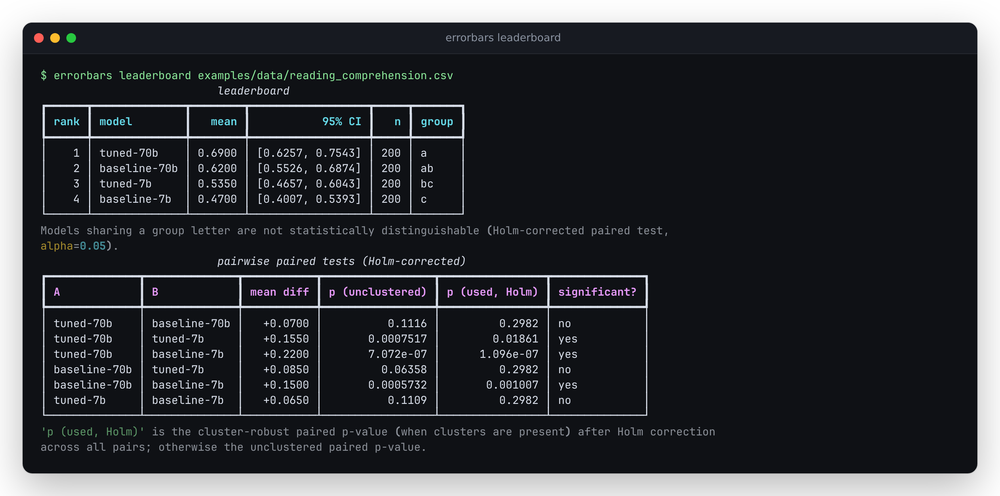
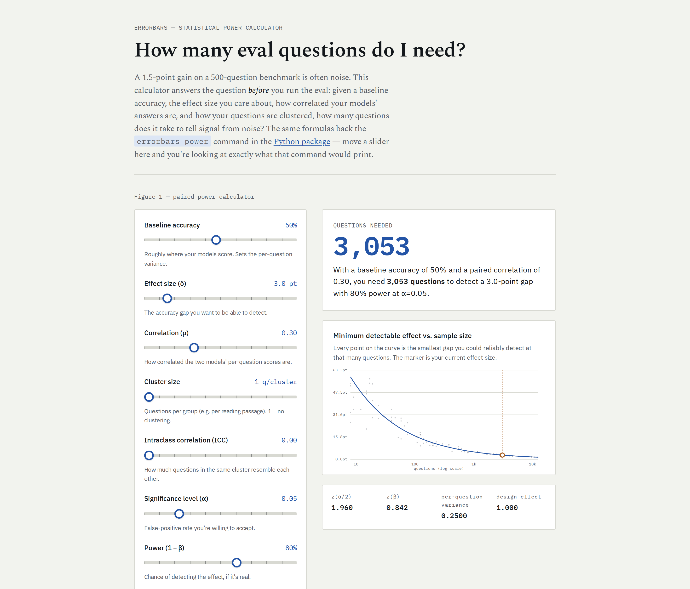

# errorbars

**Error bars for LLM evals. Know whether model B is actually better, or you're reading noise.**

[](https://github.com/antonsoo/errorbars/actions/workflows/ci.yml)
[](LICENSE)
[](https://antonsoo.github.io/errorbars/)

LLM eval results get reported as bare accuracies — "model B scored 71.2%, up from 69.7%" — with
no error bar, no significance test, and no accounting for the fact that the questions came in
correlated groups. On a 200-question benchmark, a 1.5-point gain is very often noise. Evan Miller's
"[Adding Error Bars to Evals: A Statistical Approach to Language Model
Evaluations](https://arxiv.org/abs/2411.00640)" (arXiv:2411.00640, 2024) lays out the right
practice — CLT and clustered standard errors, variance reduction through pairing, power analysis —
and this package turns it into a one-liner.



## Why this exists

Run `errorbars leaderboard` on a synthetic benchmark (below) and one apparent 7-point win —
`tuned-70b` over `baseline-70b`, 0.690 vs. 0.620 — is not statistically significant once it has a
proper error bar: the paired test already gives p = 0.11. Accounting for the fact that questions
come 5-to-a-passage, and Holm-correcting across all 6 pairwise comparisons on the board, pushes
that to p = 0.30. A naive leaderboard that ranks by bare accuracy would still have shipped the gap
as a win. The full walkthrough, with every number copied from a real command, is in
[`examples/README.md`](examples/README.md).

## Quickstart

```bash
pip install "errorbars[cli] @ git+https://github.com/antonsoo/errorbars"
errorbars power --delta 0.03 --baseline 0.5
```

```
Questions needed: 4361
```

That's how many questions you'd need to reliably detect a 3-point accuracy gap at a 50% baseline,
with the defaults (80% power, α=0.05, no pairing correlation, no clustering). Clone the repo to
try it against real per-item scores:

```bash
git clone https://github.com/antonsoo/errorbars && cd errorbars
errorbars leaderboard examples/data/reading_comprehension.csv
```

## Features

- **`summarize`** — mean, SE, and 95% CI (CLT by default, Wilson for small-n binary scores,
  bootstrap on request); clustered SE with design effect and ICC when a `cluster_id` column is
  present; within/between-question variance decomposition when a `sample` column is present.
- **`compare`** — paired mean difference, SE, CI, p-value; the correlation between the two models'
  per-question scores and how much pairing shrank the SE vs. an unpaired comparison; a
  cluster-robust paired SE/p-value when clusters are present; exact McNemar test for binary scores.
- **`leaderboard`** — every model with its CI, Holm-corrected pairwise paired tests, and groups of
  statistically indistinguishable models (maximal cliques of the "not significantly different"
  graph); a forest plot (SVG, no dependency; matplotlib if installed).
- **`power`** — number of questions needed to detect an effect δ at a given α and power, or the
  minimum detectable effect for a given n, accounting for pairing correlation, repeated sampling,
  and cluster design effect.
- **CLI** — `errorbars summarize|compare|leaderboard|power`, `rich` tables by default, `--json` for
  scripting.
- **Web calculator** — a static "how many eval questions do I need?" power calculator
  ([live demo](https://antonsoo.github.io/errorbars/)), whose TypeScript formulas are checked
  against the Python ones on every commit.
- Typed Python ≥3.10, `numpy` the only runtime dependency; `pandas` and `matplotlib` are optional
  extras; `scipy`/`statsmodels` are test-only oracles, never imported at runtime.

## Usage

```bash
errorbars summarize examples/data/reading_comprehension.csv --model tuned-70b
```

```
    summarize: tuned-70b
┏━━━━━━━━┳━━━━━━━━━━━━━━━━━━┓
┃ metric ┃            value ┃
┡━━━━━━━━╇━━━━━━━━━━━━━━━━━━┩
│ n      │              200 │
│ mean   │           0.6900 │
│ SE     │           0.0328 │
│ 95% CI │ [0.6257, 0.7543] │
│ method │              clt │
└────────┴──────────────────┘
       clustering diagnostics
┏━━━━━━━━━━━━━━━┳━━━━━━━━━━━━━━━━━━┓
┃ metric        ┃            value ┃
┡━━━━━━━━━━━━━━━╇━━━━━━━━━━━━━━━━━━┩
│ n clusters    │               40 │
│ ICC           │           0.0710 │
│ design effect │            1.284 │
│ clustered SE  │           0.0372 │
│ clustered CI  │ [0.6171, 0.7629] │
└───────────────┴──────────────────┘
```

```bash
errorbars compare examples/data/reading_comprehension.csv \
  --model-a tuned-70b --model-b baseline-70b
```

```
mean diff (A - B)                 0.0700
paired SE                         0.0440
95% CI                  [-0.0162, 0.1562]
p-value                           0.1116
correlation(A, B)                 0.1434
variance reduction from pairing     14.3%
McNemar exact p-value             0.1405
```

```bash
errorbars power --delta 0.05 --baseline 0.65 --rho 0.14 --cluster-deff 1.28
```

```
Questions needed: 1573
```

Every number above is copied verbatim from running these commands against
`examples/data/reading_comprehension.csv` (synthetic — see below). The full leaderboard output and
the reasoning behind each step are in [`examples/README.md`](examples/README.md).

### Input format

Long-format CSV or JSONL, one row per observation:

| question_id | cluster_id (optional) | model | score | sample (optional) |
|---|---|---|---|---|
| q1 | passage-003 | tuned-70b | 1 | |

Column names are configurable (`--question-col`, `--cluster-col`, etc., or `ColumnMap` in Python).
Scores can be binary (0/1) or continuous. `cluster_id` groups correlated questions (e.g. several
questions per reading passage); `sample` marks repeated generations of the same question.

There are no adapters for lm-evaluation-harness or Inspect AI log formats in this release — their
exact JSON schemas need verification against the current tool versions to get right, and getting a
data-provenance detail wrong is worse than not shipping it. Point either tool's `--log_samples`
output at a short `jq`/`pandas` reshape into the format above; it's a handful of lines.

## How it works

Every statistic is implemented from scratch on `numpy` + the standard library
(`statistics.NormalDist` for the normal quantile function) — no scipy or statsmodels at runtime.
Full derivations with references are in [`docs/formulas.md`](docs/formulas.md):

1. CLT and Wilson confidence intervals for a mean
2. Cluster-robust standard errors (the CR1 sandwich estimator, matching
   `statsmodels`' `cov_type="cluster"`)
3. Intraclass correlation and Kish's design effect
4. Within/between-question variance decomposition for repeated sampling
5. Paired comparisons, variance reduction from pairing, and exact McNemar
6. Holm-Bonferroni correction and maximal-clique grouping for leaderboards
7. Power analysis (sample size and minimum detectable effect) under pairing and clustering

## Accuracy and limitations

- Cluster-robust SE matches `statsmodels`' `OLS(..., cov_type="cluster")` to 1e-9 on both balanced
  and unbalanced cluster sizes; Wilson intervals match `statsmodels.stats.proportion_confint` to
  1e-9; the paired t-test and McNemar's exact test are cross-checked against `scipy`/`statsmodels`.
  See `tests/test_stats_vs_oracles.py` and `tests/test_compare_vs_oracles.py`.
- Monte Carlo coverage tests (`tests/test_coverage_montecarlo.py`) confirm nominal 95% CIs cover
  the true parameter close to 95% of the time — for CLT, Wilson, bootstrap, and cluster-robust
  intervals — with a tolerance sized to the trial count so it won't flake.
- The paired-comparison p-value uses the normal approximation, not the exact t-distribution;
  matches `scipy.stats.ttest_rel` closely once n ≳ 30, and is somewhat conservative below that.
- The power formula's samples-per-question adjustment assumes all single-sample variance is
  decoding noise (see `docs/formulas.md` §11 for why, and the caveat on when this is optimistic).
  It's a planning tool for before you run the eval; for a post-hoc measurement with the true
  within/between-question split, use `summarize` on data with a `sample` column instead.
- Leaderboard groups are maximal cliques of the "not significantly different" graph, which is the
  statistically direct approach — it can produce a model in more than one group, unlike a
  minimal-letters heuristic (e.g. R's `multcompView`).
- 81 Python tests, 602 TypeScript tests (cross-checking the JS formulas against Python-generated
  vectors), all passing on this box (14 vCPU WSL2 Linux, 48 GB RAM; Python 3.12.3, Node 26.7.0)
  as of 2026-09-24.

## Web calculator

[`web/`](web/) is a static Vite + TypeScript "how many eval questions do I need?" calculator
([live demo](https://antonsoo.github.io/errorbars/)). Its power formulas
(`web/src/power.ts`, `web/src/normal.ts`) are a direct port of `src/errorbars/power.py`; Python
generates JSON test vectors (`scripts/export_test_vectors.py` → `web/test-vectors.json`) that the
TypeScript test suite checks against, so the two implementations can't silently drift apart.



## Development

```bash
uv sync --group dev --extra all
uv run pytest
uv run ruff check .
uv run mypy src/errorbars
```

See [`CONTRIBUTING.md`](CONTRIBUTING.md) for the web calculator's dev loop and guidelines.

## Contributing

Issues and PRs welcome. Any new statistic needs a test against an independent oracle (reference
library, closed form, or Monte Carlo simulation) — see `tests/` for the pattern.

## Citations

```bibtex
@misc{miller2024addingerrorbarsevals,
  title  = {Adding Error Bars to Evals: A Statistical Approach to Language Model Evaluations},
  author = {Evan Miller},
  year   = {2024},
  eprint = {2411.00640},
  archivePrefix = {arXiv},
  primaryClass  = {stat.AP},
  url    = {https://arxiv.org/abs/2411.00640}
}
```

## License

[MIT](LICENSE) © 2026 Anton Soloviev
