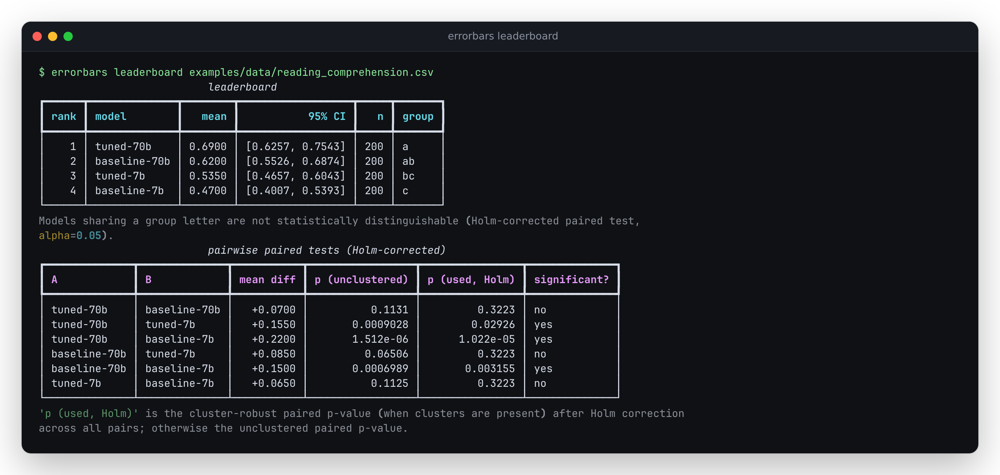
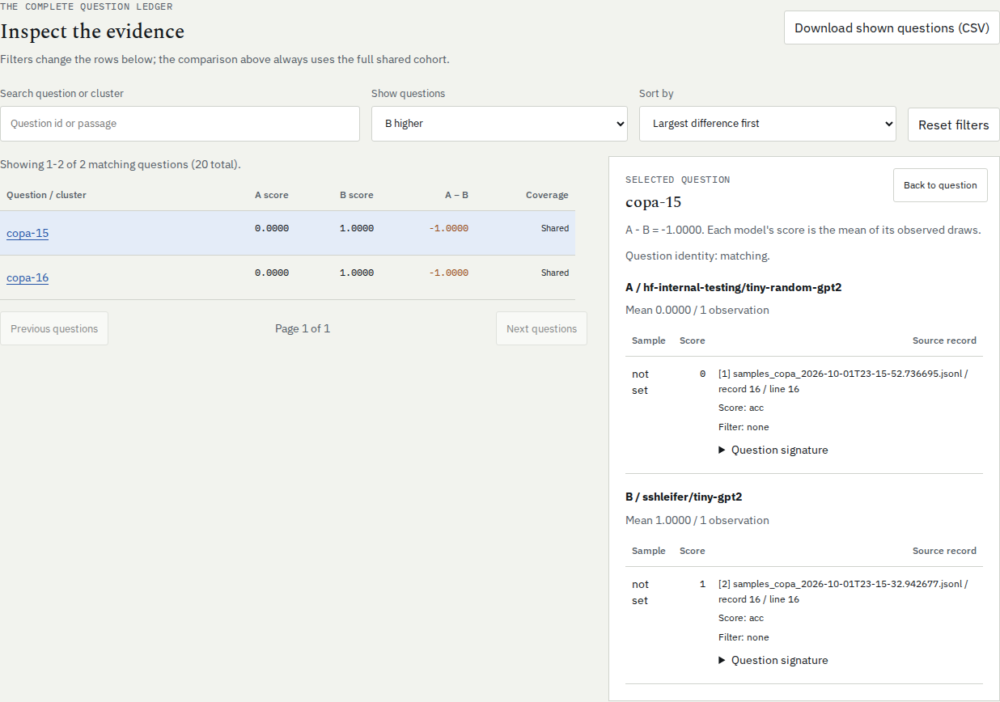
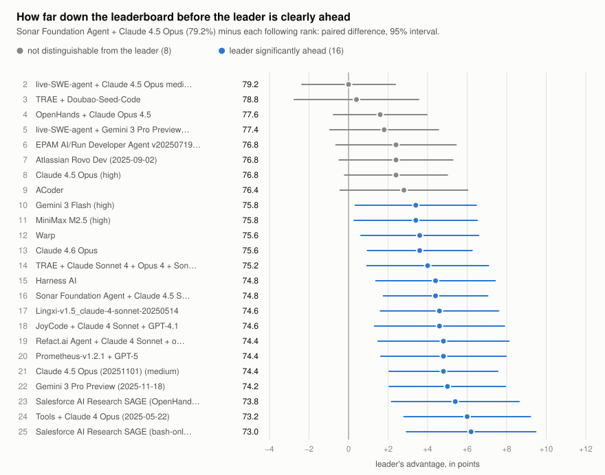
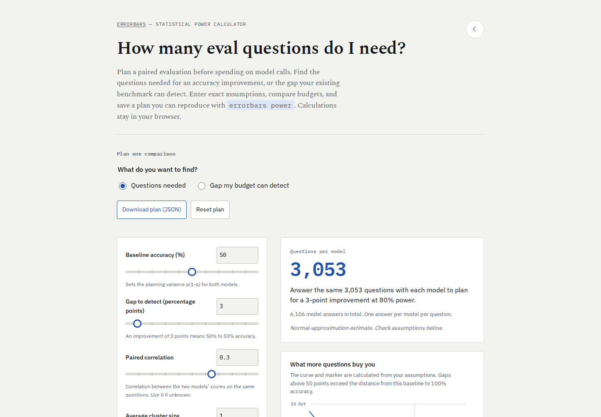

# errorbars

**Error bars for LLM evals. Know whether model B is actually better, or you're reading noise.**

[](https://pypi.org/project/errorbars/)
[](LICENSE)
[](https://antonsoo.github.io/errorbars/)
[](https://huggingface.co/spaces/antonsoloviev/errorbars)

LLM eval results get reported as bare accuracies — "model B scored 71.2%, up from 69.7%" — with
no error bar, no significance test, and no accounting for the fact that the questions came in
correlated groups. On a 500-question benchmark, a 1.5-point gain is very often noise: at a 50%
baseline you'd need roughly a 9-point gap to reliably detect anything at 80% power, α=0.05
(`errorbars power --n 500 --baseline 0.5` → minimum detectable effect ≈ 8.9 points). Evan Miller's
"[Adding Error Bars to Evals: A Statistical Approach to Language Model
Evaluations](https://arxiv.org/abs/2411.00640)" (arXiv:2411.00640, 2024) lays out the right
practice — CLT and clustered standard errors, variance reduction through pairing, power analysis —
and this package turns it into a one-liner.



The source checkout can also open a comparison at the question level:
**`errorbars compare ... --html comparison.html`** produces one offline file with
shared and missing questions, individual generations, source records and cluster
sensitivity. Native lm-eval and text-only Inspect imports check recorded question
content before pairing reused IDs. Inspect imports also reject incomplete runs;
the [retained example](examples/inspect-comparison/README.md) shows a meaningless
paired result (p = 0.000000644) replaced by 24 content conflicts. These additions
are **unreleased**; install this checkout to use them.
[Comparison walkthrough](docs/comparison-reports.md).



## On a real leaderboard

[**SWE-bench Verified, with error bars**](studies/swe-bench-verified/README.md) runs this package
over the per-task results of all 173 usable public submissions. The short version:

- Among the 78 submissions scoring 60% or more, a gap under 3 points is below what the
  benchmark can detect (paired standard error about 1.8 points): 1 of 874 such pairs differs
  at the 5% level. Two submissions tie for the lead at 79.2%, and the leader cannot be told
  apart from ranks 2 to 9; only 7 of its 24 comparisons with ranks 2 to 25 differ after
  Holm's correction.
- The top score went up 30 times in two years. Six of those new records were significantly
  above the record they replaced.
- The 500 tasks come from 12 repositories and 231 are Django. For a claim about other
  codebases the benchmark has about 3.3 effective degrees of freedom.

<picture>
  <source media="(prefers-color-scheme: dark)" srcset="studies/swe-bench-verified/figures/leader-dark.svg">
  
</picture>

The source checkout also has a page that runs the same paired test in the browser for any two
of those submissions, or for a run of your own pasted in as a list of resolved task ids
(`web/swe-bench.html`; its statistics are checked against this package on real pairs).


Running it there also showed that this package's own clustered test was wrong for that
benchmark, and too slow for a board of that size. Both are fixed in this checkout
(**unreleased**; see the [changelog](CHANGELOG.md)).

## Why this exists

Run `errorbars leaderboard` on a synthetic benchmark (below) and one apparent 7-point win —
`tuned-70b` over `baseline-70b`, 0.690 vs. 0.620 — is not statistically significant once it has a
proper error bar: the paired test already gives p = 0.11. Accounting for the fact that questions
come 5-to-a-passage, and Holm-correcting across all 6 pairwise comparisons on the board, pushes
that to p = 0.32. A naive leaderboard that ranks by bare accuracy would still have shipped the gap
as a win. The full walkthrough, with every number copied from a real command, is in
[`examples/README.md`](examples/README.md).

## Quickstart

```bash
pip install errorbars
errorbars power --delta 0.03 --baseline 0.5
```

```
Questions needed: 4361
```

That's how many questions you'd need to reliably detect a 3-point accuracy gap at a 50% baseline,
with the defaults (80% power, α=0.05, no pairing correlation, no clustering). Clone the repo to
try it against real per-item scores:

```bash
git clone https://github.com/antonsoo/errorbars && cd errorbars
errorbars leaderboard examples/data/reading_comprehension.csv
```

## Features

- **`summarize`** — mean, SE, and 95% CI (CLT by default, Wilson for binary scores with few
  questions or a score near 0 or 1, bootstrap on request); clustered SE with its effective degrees of freedom, design effect and
  ICC when a `cluster_id` column is present; within/between-question variance decomposition
  when a `sample` column is present.
- **`compare`** — selects exact binary, clustered, or paired-t inference from the shared
  observations and retains diagnostic SEs, intervals and p-values; the correlation between the two models'
  per-question scores and how much pairing shrank the SE vs. an unpaired comparison; a
  cluster-robust paired SE/CI/p-value when clusters are present, which stays valid when the
  clusters are few or very unequal in size; exact McNemar test for binary scores.
- **Comparison evidence (source checkout)** — `compare --html report.html` opens a complete
  question ledger with both run means, observed generations and source line/record locations.
  Find lower scores and missing questions, inspect which passages drive the result, and download
  complete JSON or filtered CSV. One file, including fonts; no server or upload.
- **`leaderboard`** — every model with its CI and exact ranks without a significant
  Holm-corrected paired difference. Untested pairs remain explicit; rank gaps are preserved. This checkout selects exact McNemar for one binary score per shared
  question, clustered t for grouped questions, and paired t for continuous or repeated
  scores. The table and JSON name the selected test; a shared group does not establish
  equivalence. [Counterexample, exact checks, and public-data audit](docs/leaderboard-tests.md).
  Supplied clusters also determine the displayed model confidence intervals;
  the old independent-question estimate remains a labelled JSON diagnostic.
  [Why exact rank sets matter on 173 public submissions](studies/leaderboard-ranks/README.md).
  Forest plots name the interval method and wrap full model names. The CLI writes
  SVG without dependencies; Python callers can also use the matplotlib extra.
- **`power`** — number of questions needed to detect an effect δ at a given α and power, or the
  minimum detectable effect for a given n, accounting for pairing correlation, repeated sampling,
  and cluster design effect. Repeated-answer plans in this checkout require an explicit
  within-question correlation and retain the variance that more answers cannot remove.
  [Real-outcome check and budget counterexample](docs/repeated-planning.md).
- **CLI** — `errorbars summarize|compare|leaderboard|power|import`. Tables are plain aligned text
  on a bare install (numpy is the only dependency) and `rich` tables with
  `pip install "errorbars[cli]"`; either way a model name is printed whole, and a table written to
  a pipe is as wide as it needs to be. `--json` for scripting.
- **Reads what harnesses write** — a harness leaves one log per model, so every command takes
  one or more files or directories and reads each as what it is: lm-evaluation-harness
  `--log_samples` output, Inspect AI `.eval` logs, or the CSV/JSONL format below.
  `errorbars compare out/model-a out/model-b` is the whole comparison (see
  [below](#reading-lm-evaluation-harness-and-inspect-ai-logs)).
- **Web calculator** — plan the questions needed for an accuracy improvement or the gap a
  fixed budget can detect. Exact editors, a computed budget table, pairing sensitivity,
  explicit assumptions, JSON plans, and reproducible CLI commands. The TypeScript formulas
  are checked against Python-generated vectors. [Planning guide](docs/planning.md).
- Typed Python ≥3.10, `numpy` the only runtime dependency; `pandas` and `matplotlib` are optional
  extras; `scipy`/`statsmodels` are test-only oracles, never imported at runtime.

## Usage

```bash
errorbars summarize examples/data/reading_comprehension.csv --model tuned-70b
```

```
summarize: tuned-70b
metric             value
------  ----------------
n                    200
mean              0.6900
SE                0.0328
95% CI  [0.6257, 0.7543]
method               clt

clustering diagnostics
metric                         value
------------------  ----------------
n clusters                        40
ICC                           0.0710
design effect                  1.284
clustered SE                  0.0372
clustered CI        [0.6148, 0.7652]
degrees of freedom              39.0
```

```bash
errorbars compare examples/data/reading_comprehension.csv \
  --model-a tuned-70b --model-b baseline-70b
```

```
mean diff (A - B)                 0.0700
paired SE                         0.0440
95% CI                  [-0.0167, 0.1567]
p-value                           0.1131
correlation(A, B)                 0.1434
variance reduction from pairing     14.3%
McNemar exact p-value             0.1405
```

```bash
errorbars power --delta 0.05 --baseline 0.65 --rho 0.14 --cluster-deff 1.28
```

```
Questions needed: 1573
```

Every number above is copied verbatim from running these commands against
`examples/data/reading_comprehension.csv` (synthetic — see below). The full leaderboard output and
the reasoning behind each step are in [`examples/README.md`](examples/README.md).

### Input format

Long-format CSV or JSONL, one row per observation:

| question_id | cluster_id (optional) | model | score | sample (optional) | question_hash (optional) |
|---|---|---|---|---|---|
| q1 | passage-003 | tuned-70b | 1 | | |

Column names are configurable (`--question-col`, `--cluster-col`, etc., or `ColumnMap` in Python).
Scores can be binary (0/1) or continuous. `cluster_id` groups correlated questions (e.g. several
questions per reading passage); `sample` marks repeated generations of the same question.

Each question has equal weight in summaries, leaderboard means, and paired comparisons.
Repeated generations are averaged within a question first. `n` counts questions; JSON also
retains `n_observations`, and tables show the generation count when repetitions are present.
For example, ten successful generations of q1 and one failed generation of q2 have a question
mean of **0.5**, rather than a draw-weighted **10/11**. The runnable synthetic example is in
[the repeated-generation walkthrough](examples/README.md#unequal-repeated-generations).

Identifiers must be nonempty scalar values. Duplicate CSV columns or JSON fields, explicit
missing sample/cluster labels, and contradictory cluster assignments are rejected. A question's
cluster is shared across models. When combining files, missing cluster metadata can be resolved
from another file for the same question; every other question needs an explicit assignment.

Every command takes several files (`errorbars leaderboard model-a.csv model-b.csv ...`) and puts
their rows together. The same model, question and sample in two files is refused, as it is within
one file: counted twice it would inflate n and shrink every error bar.

In the source checkout, optional `question_hash` signatures are retained through canonical
CSV/JSONL import/export (`--question-hash-col` maps another column name). Known conflicting
signatures for a shared ID stop paired comparisons and leaderboards; conflicting repeated
samples within one model are refused before averaging. Missing signatures stay unchecked.
Use the same signature scheme in both runs; a signature is an assertion about question
content, not proof that the scoring rules match.

### Reading lm-evaluation-harness and Inspect AI logs

A harness writes one log per model and per task, so "is B better than A" starts from two files.
`summarize`, `compare` and `leaderboard` read them as they are:

```bash
# lm-evaluation-harness: lm_eval run --model hf --model_args pretrained=<model> --tasks copa \
#                          --log_samples --output_path out      (one directory per model)
errorbars compare out/sshleifer__tiny-gpt2 out/hf-internal-testing__tiny-random-gpt2
```

```
compare: sshleifer/tiny-gpt2 vs hf-internal-testing/tiny-random-gpt2
metric                                                             value
-----------------------------------------------------  -----------------
n (shared questions)                                                  20
mean(sshleifer/tiny-gpt2)                                         0.6000
mean(hf-internal-testing/tiny-random-gpt2)                        0.8000
mean diff (A - B)                                                -0.2000
paired SE                                                         0.1376
95% CI                                                 [-0.4881, 0.0881]
p-value                                                           0.1625
correlation(A, B)                                                 0.1021
unpaired SE (for reference)                                       0.1451
variance reduction from pairing                                    10.0%
McNemar discordant (A wrong/B right, A right/B wrong)              6 / 2
McNemar exact p-value                                             0.2891
```

That is a real run, committed under `tests/fixtures/lm_eval_output/` (two tiny models, 20 COPA
questions). lm-eval's own table says 0.6 ± 0.11 and 0.8 ± 0.09; the paired test on the same 20
answers gives p = 0.16, so the 20-point gap is not evidence yet. (Rows trimmed; the command prints
a few more.)

```bash
errorbars leaderboard out                       # every model under the output directory
errorbars compare logs/run-a.eval logs/run-b.eval           # Inspect AI logs
errorbars compare greedy=logs/a.eval sampled=logs/b.eval    # two runs of one model, told apart
errorbars import lm-eval out -o all.csv         # or write the canonical CSV once and keep it
```

- **lm-eval**: a `samples_<task>_<timestamp>.jsonl` file, a model's directory, or the whole
  `--output_path`. The samples file does not name its model; lm-eval writes it beside a
  `results_<timestamp>.json` that does, and that is where the name comes from. A samples file
  moved away from it has to be named: `my-model=path/to/samples_copa_....jsonl`. In this
  source checkout, a renamed file or a results file with a different timestamp also needs
  an explicit name; a nearby run cannot identify these samples. When a directory
  holds several runs of a task, the latest is used and a note says so. Question ids are
  `<task>-<doc_id>`, so several tasks of one model add up to one benchmark.
- **Inspect AI**: `.eval` (or `.json`) logs; the model is the one in the log. Epochs (`--epochs N`,
  repeated sampling of the same input) land in the `sample` column automatically. In this
  checkout, imports require a successful run with all planned samples completed and recorded.
- With exactly two models in the input, `compare` needs no `--model-a`/`--model-b`: A is the first
  one given. When the two cover different selected questions (such as different `--limit`
  values), the comparison uses the shared ones and reports how many were left out.

`--metric` (lm-eval) picks which computed metric to use as the score when a task reports more than
one (e.g. `acc` vs. `acc_norm`). **The source checkout requires this choice when several
metrics are available**; the released package defaults to the first one. The chosen metric
must be declared on every selected record, and native logs with shared questions must use
the same metric. Metadata such as `doc_id` cannot be selected as scores.
In a [controlled lm-eval capture](studies/lm-eval-evidence/README.md), changing only metric
order previously created a 100-point gap and p = 0.000000119 between identical responses.
Explicit selection gives zero difference. These importer corrections are unreleased.
`--filter` (lm-eval) picks one filter
for a task that scores every question under several: `gsm8k_cot_self_consistency` logs each question
three times (`score-first`, `maj@8`, `maj@64`), and reading those as three times the questions would
shrink every error bar, so the import stops and asks. `--scorer` (Inspect) picks one scorer for
tasks with more than one.

Both adapters were built and tested against real, unedited output — not from memory: **lm-eval
0.4.13** (`lm_eval run --model dummy --tasks copa --limit 20 --log_samples ...`, a multi-metric
`arc_easy` run, a three-filter `gsm8k_cot_self_consistency` run, and the two-model output directory
above) and **inspect-ai 0.3.268** (small tasks through the built-in `mockllm/model` provider: single
epoch, two epochs, and a scorer with named values). The exact log files are committed as test
fixtures (`tests/fixtures/samples_*.jsonl`, `tests/fixtures/lm_eval_output/`,
`tests/fixtures/inspect_*.eval`) and re-parsed in `tests/test_adapters.py` and
`tests/test_inputs.py` on every run. The Inspect adapter reads logs with Inspect's own
`inspect_ai.log.read_eval_log` and `inspect_ai.scorer.value_to_float` rather than hand-parsing its
binary `.eval` format, and needs the `inspect` extra:
`pip install "errorbars[inspect]"`. The lm-eval
adapter has no extra dependency — `--log_samples` is already plain JSONL.

Inspect imports refuse unscored samples, missing grades and unrecognized grade strings.
The source checkout also checks status, planned/completed/recorded counts, selected IDs,
epochs and invalidations. Cancelled, failed, drained or incompletely recorded evaluations
cannot quietly become smaller successful datasets. A completed `--limit` or `--sample-id`
selection is accepted. One scorer must be present across the entire imported log.
Valid `C`/`I`/`P`/`N`, boolean representations and finite numeric scores keep Inspect's
conversion semantics. Finish or retry an incomplete evaluation before importing its log.
lm-eval records require a valid `doc_id`; row order is never
used to fabricate question identity.

The source lm-eval adapter also computes a versioned SHA-256 signature from each logged
document and target. It ignores prompt arguments and responses so prompt variants remain
comparable. It computes the signature from the contents, rather than trusting the stored
`doc_hash`. Empty/missing documents or null/missing targets leave identity unchecked.
Text-only Inspect samples are signed from the logged dataset input, ordered choices and
targets. Solver messages and generated message IDs are excluded, preserving ordinary solver
prompt experiments. Changing the dataset input itself triggers a conservative conflict;
multimodal or externally backed samples remain unchecked. Signatures survive CSV imports.
[Identity scope and recovery](docs/comparison-reports.md#question-identity).

## How it works

Every statistic is implemented from scratch on `numpy` + the standard library
(`statistics.NormalDist` for normal quantiles; Student-t tails from a continued-fraction incomplete
beta function) — no scipy or statsmodels at runtime.
Full derivations with references are in [`docs/formulas.md`](docs/formulas.md):

1. CLT and Wilson confidence intervals for a mean
2. Cluster-robust standard errors: the bias-reduced CR2 sandwich estimator with Satterthwaite
   degrees of freedom, and why the usual CR1 on t(G − 1) is not used
3. Intraclass correlation and Kish's design effect
4. Within/between-question variance decomposition for repeated sampling
5. Paired comparisons, variance reduction from pairing, and exact McNemar
6. Holm-Bonferroni correction and maximal-clique grouping for leaderboards
7. Power analysis (sample size and minimum detectable effect) under pairing and clustering

## Accuracy and limitations

- The cluster-robust SE and its degrees of freedom match the general matrix definitions,
  evaluated independently, to 1e-9 on unequal cluster sizes (`tests/test_few_clusters.py`); the
  classic CR1 estimator, still available as `kind="CR1"`, matches `statsmodels`'
  `OLS(..., cov_type="cluster")` to 1e-9. Wilson intervals match
  `statsmodels.stats.proportion_confint` to 1e-9; the paired t-test matches
  `scipy.stats.ttest_rel` to 1e-7 at any n, and McNemar's exact test is cross-checked against
  `statsmodels`. See `tests/test_stats_vs_oracles.py` and `tests/test_compare_vs_oracles.py`.
- Monte Carlo coverage tests (`tests/test_coverage_montecarlo.py`) confirm nominal 95% CIs cover
  the true parameter close to 95% of the time — for CLT, Wilson, bootstrap, and cluster-robust
  intervals — with a tolerance sized to the trial count so it won't flake.
- Paired comparisons use Student's t with n − 1 degrees of freedom, like `scipy.stats.ttest_rel`.
  Clustered SEs use t with Satterthwaite degrees of freedom: G − 1 for G clusters of equal
  size, fewer when sizes differ (3.3 for SWE-bench Verified's 12 repositories). The usual
  CR1 estimator on t(G − 1) rejects a true null two to three times too often on those sizes; this
  one rejects 3.0% to 5.2% of true nulls on those sizes, and is conservative (3.0% for a 5% test) when there is
  in fact no clustering. The unclustered and clustered tests answer different questions (more
  questions from the same clusters; new clusters), and with few clusters the second can say
  very little. The per-model `clt` interval stays normal-based, which is only right once n is
  in the dozens.
- Repeated-generation intervals use the distribution of question averages; Wilson is reserved
  for single binary observations per question. CLT and percentile bootstrap estimates remain
  approximate, especially with very few questions. Within/between decomposition retains the
  original draws. One independent cluster cannot estimate a cluster-robust SE and is rejected.
- Zero-variance paired differences carry explicit warnings: nonzero differences use the
  t-test's p=0 limit, while identical scores use p=1 by convention. Point intervals do not
  establish certainty about the population. Exact McNemar results remain available for binary
  pairs; scores merely near 0 or 1 remain continuous. Nonzero score units are rescaled before
  variance calculations to avoid underflow in SEs and paired tests.
- Pairing diagnostics preserve unavailable values: `correlation` is `null` when either
  vector is constant, and `variance_reduction` is `null` when both are constant. The CLI
  prints `unavailable`; downstream code must check for `None` before formatting these fields.
- Repeated-answer power plans require `--repeat-correlation` when `--samples-per-question > 1`
  in this checkout. The old independence assumption understated the variance at 100 answers
  per question by 41-48 times in two published GSM8K runs. The [retained study](studies/repeated-planning/README.md)
  checks variance on later draws of the same questions; it does not validate power on new questions.
  The equal-variance normal approximation still needs defensible pilot assumptions, and pairing
  correlation must describe the averages at the requested repeat count. This repair is unreleased.
- Leaderboard groups are maximal cliques of the "not significantly different" graph, which is the
  statistically direct approach — it can produce a model in more than one group, unlike a
  minimal-letters heuristic (e.g. R's `multcompView`).
- [Verification evidence](docs/verification-2026-10-04.md) records the current planning
  checks, supported environments, browser coverage, and limits of the audit.
- [Data-integrity verification](docs/data-integrity-2026-10-04.md) records the subsequent
  repeated-generation, paired-test and metadata audit. Those changes are local and unreleased.

## Web calculator

[`web/`](web/) is a static Vite + TypeScript "how many eval questions do I need?" calculator
([live demo](https://antonsoo.github.io/errorbars/)). Its power formulas
(`web/src/power.ts`, `web/src/normal.ts`) are a direct port of `src/errorbars/power.py`; Python
generates JSON test vectors (`scripts/export_test_vectors.py` → `web/test-vectors.json`) that the
TypeScript test suite checks against. The Python suite also checks that the committed
vectors match the current implementation.

Choose **Questions needed** or **Gap my budget can detect**. Number fields keep exact
inputs; invalid edits disable results and downloads until corrected. The chart and table
contain calculated values only, and a comparison at correlation zero exposes how much the
answer depends on pairing. Small question/group counts and gaps beyond 100% accuracy carry
explicit warnings. The normal approximation remains a planning estimate.

**Download plan (JSON)** retains inputs, units, results, assumptions and a complete
`errorbars power` command. Calculations and downloads stay local and work offline after
load; only the theme is persisted. See [Evaluation planning](docs/planning.md) for the
artifact schema, browser input ranges, and statistical limitations.



## Development

```bash
uv sync --group dev --extra all
uv run pytest
uv run ruff check .
uv run mypy src/errorbars
```

See [`CONTRIBUTING.md`](CONTRIBUTING.md) for the web calculator's dev loop and guidelines.

## Contributing

Issues and PRs welcome. Any new statistic needs a test against an independent oracle (reference
library, closed form, or Monte Carlo simulation) — see `tests/` for the pattern.

## Citations

```bibtex
@misc{miller2024addingerrorbarsevals,
  title  = {Adding Error Bars to Evals: A Statistical Approach to Language Model Evaluations},
  author = {Evan Miller},
  year   = {2024},
  eprint = {2411.00640},
  archivePrefix = {arXiv},
  primaryClass  = {stat.AP},
  url    = {https://arxiv.org/abs/2411.00640}
}
```

## License

[MIT](LICENSE) © 2026 Anton Soloviev. The browser quantile adaptation and local
fonts retain their upstream licenses; see [third-party notices](THIRD_PARTY_NOTICES.md).

---

<sub>Part of [Officina](https://antonsoo.github.io/officina/), a set of small open-source tools by [Anton Soloviev](https://github.com/antonsoo).</sub>
