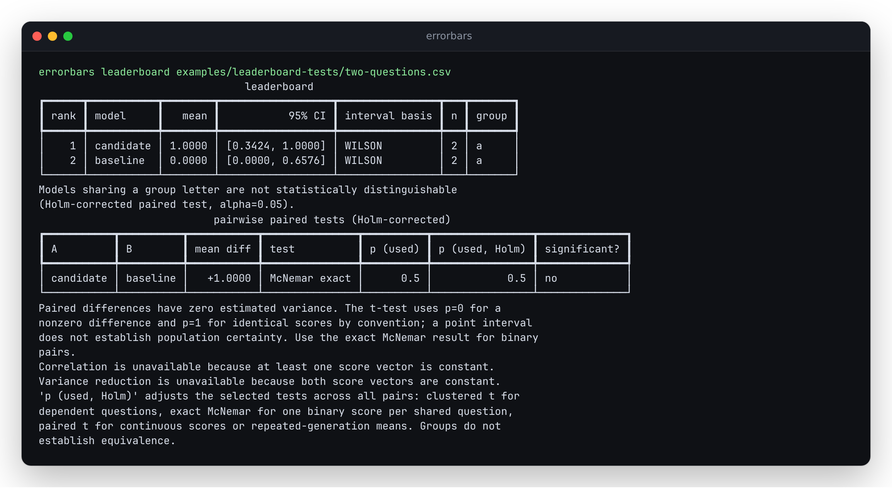
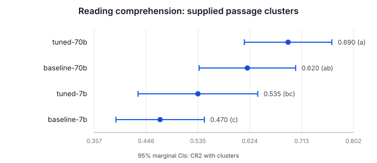

# Leaderboard tests and intervals must match the observations

With two shared binary questions, candidate=[1,1] and baseline=[0,0], the
leaderboard used to print p=0 and separate the models into different groups.
`paired_compare` already computed the exact McNemar p=0.5, but the leaderboard
ignored it and used its degenerate paired-t diagnostic.

The repaired leaderboard selects a test from the structure of each pair's
**shared observations**, before applying Holm across the whole board:

| Shared data | Selected test | JSON `test` |
|---|---|---|
| Multiple questions grouped in clusters | Existing CR2 clustered t test | `clustered_t` |
| One binary score per question, no grouped questions | Exact McNemar | `mcnemar_exact` |
| Continuous scores or repeated-generation question means | Paired t | `paired_t` |

Singleton cluster labels do not create dependence. Repeated generations on
unmatched questions do not change a binary shared comparison. Repeated means
that happen to equal 0 or 1 remain on the paired-t path. The method is never
chosen by the smaller of two p-values. Boards with mixed methods still have
one Holm family.



The terminal table names the selected test and prints both its raw and
adjusted p-value. JSON adds `test`, `p_value_used`, and `mcnemar`; the existing
`p_value` continues to mean the unclustered paired-t diagnostic for compatibility.
Consumers should use `p_value_used` for the selected raw test and `p_holm` for
grouping. `compare` still exposes its existing diagnostics. Question weighting
is unchanged: every question has equal weight after averaging its generations.

## Confidence intervals also honor supplied clusters

A separate inconsistency appeared in the same workflow: pairwise tests used
clusters, but displayed means and forest plots silently used independent-question
intervals. The leaderboard now selects CR2 standard errors and Student-t
critical values with effective degrees of freedom for each model with grouped
questions, matching `summarize` on the same data.

On the existing **synthetic** reading-comprehension example, each model has
200 questions grouped into 40 passages:

| Model | Previous independent-question 95% CI | Current clustered 95% CI |
|---|---|---|
| tuned-70b | [0.62574, 0.75426] | [0.61480, 0.76520] |
| baseline-70b | [0.55256, 0.68744] | [0.53704, 0.70296] |
| tuned-7b | [0.46570, 0.60430] | [0.43218, 0.63782] |
| baseline-7b | [0.40066, 0.53934] | [0.39397, 0.54603] |

For tuned-7b the interval is 48% wider. This is a measured effect on this
example, not a claim that clustering always widens an interval.



The table names its interval basis. JSON entries retain the confidence level,
`n_clusters`, `dof_clustered`, `method="clustered_cr2"`, and the prior
`unclustered` estimate as a labelled diagnostic. Plots name their interval
methods and confidence level. These are marginal intervals, not simultaneous
intervals or pairwise-difference intervals.

Fewer than two independent clusters cannot estimate grouped uncertainty:
the command refuses that model's interval instead of falling back to an
independent-question interval. Few effective degrees of freedom and zero
cluster variance remain explicit warnings. Repeated generations are averaged
before clustering; seven generations of one question do not give that question
seven times the weight. Singleton cluster labels preserve the existing CLT or
Wilson interval selection.

The mean, SE, degrees of freedom, and endpoints are checked against a separate
dense-matrix regression calculation (`tests/oracles.py`) and SciPy's Student-t
quantiles for equal and unequal cluster sizes at 90%, 95%, and 99% confidence.
The CLI replay separately compares each model's interval with `summarize`.
[Before](../examples/leaderboard-tests/intervals-before.json) and
[after](../examples/leaderboard-tests/intervals-after.json) retain the full output.

## Independent checks

For discordant binary pairs, the exact test uses the binomial distribution;
see the [statsmodels McNemar documentation](https://www.statsmodels.org/stable/generated/statsmodels.stats.contingency_tables.mcnemar.html).
The small-table checks compare the selected leaderboard result against that
implementation. Holm results are also compared against
[statsmodels multipletests](https://www.statsmodels.org/stable/generated/statsmodels.stats.multitest.multipletests.html).

The retained audit also enumerates a conditional null exactly: all questions
are discordant, with either model equally likely to win each independent
question. These are exact probabilities, not Monte Carlo estimates and not
an empirical benchmark of model quality:

| Discordant questions | Prior paired-t rejection probability | Exact rejection probability |
|---|---:|---:|
| 2 | 0.500000 | 0.000000 |
| 3 | 0.250000 | 0.000000 |
| 4 | 0.125000 | 0.000000 |
| 5 | 0.062500 | 0.000000 |
| 6 | 0.031250 | 0.031250 |
| 8 | 0.070313 | 0.007813 |
| 10 | 0.021484 | 0.021484 |
| 20 | 0.041389 | 0.041389 |
| 40 | 0.038477 | 0.038477 |

The nominal level is 0.05, with rejection at p<0.05. At two questions, both
outcomes matching has probability one half; the prior t convention reports
zero variance and p=0 for those outcomes. The exact test cannot reject at
that sample size. Discreteness can make it conservative.

## Retained real inputs

The [audit script](../studies/leaderboard-tests/audit.py) reuses the existing
[pinned SWE-bench outcomes](../studies/swe-bench-verified/README.md) and native
lm-eval logs. It downloads nothing. The same two submissions excluded by the
original SWE-bench study for contradictory reported scores stay excluded.
Both old and new leaderboard policies use the same current readers and
comparison functions.

| Analysis | Models | Questions | Pair tests | Previously significant | Now significant |
|---|---:|---:|---:|---:|---:|
| SWE-bench, treating tasks as independent | 173 | 500 | 14,878 | 10,720 | 10,657 |
| SWE-bench, clustered by repository | 173 | 500 | 14,878 | 1 | 1 |
| Native lm-eval COPA captures | 2 | 20 | 1 | 0 | 0 |

In the task-independent analysis, 64 pairs cease to be significant and one
becomes significant after the changed raw values pass through Holm. The
exact result is not uniformly larger than the t approximation. The number
of maximal groups remains 117, though pair edges change. Repository-clustered
p-values and groups are **exactly unchanged**; all 173 displayed model
intervals now use those supplied repository clusters too. This is a check of
the selection policy, not evidence that SWE-bench tasks are independent.
The repository grouping is preserved by the study's default CSV exporter.

For the two real COPA captures, the selected p-value changes from 0.162550 to
0.2890625, based on 6 versus 2 discordant wins. The two models remain in one
group. The standard-library CLI replay reconstructs these counts directly
from native sample records, checks their 20 shared document IDs, and checks
the exact tail independently of Errorbars' adapter.

The [retained audit](../studies/leaderboard-tests/results.json) contains input
and code hashes, exclusions, exact null probabilities, every changed pair,
the changed clustered intervals, and the native COPA before/after report. Reproduce from a development install:

```bash
uv run python scripts/verify_leaderboard_tests.py --out /tmp/leaderboard-workflows.json
uv run python studies/leaderboard-tests/audit.py --out /tmp/leaderboard-audit.json
```

The audit needs statsmodels from the development dependencies. The installed
CLI replay uses only the standard library in its driver and NumPy in the
package. [The tiny counterexample](../examples/leaderboard-tests/README.md)
also retains complete CLI before/after JSON.

## Limits

Failing to separate two models is not evidence of equivalence. Exact McNemar
requires independent paired binary observations; it does not correct hidden
question dependence, unmatched populations, leaked benchmark questions, or
adaptive selection of evaluations. Explicit clusters take precedence.
Continuous and repeated-generation t inference retains its assumptions and
zero-variance warnings. The change does not turn marginal intervals into
simultaneous intervals, and different model means can still cover different
question sets. All changes here are local and unreleased.

## Local verification

A fresh locked development installation from a clean checkout passed ruff,
mypy, and 501 checks, including the independent matrix and exact-test oracles.
The package built as a wheel from its source distribution. The four native
and controlled CLI workflows also passed in isolated wheel installations:
Python 3.10.21 with NumPy 1.24.0, and Python 3.14.7 with NumPy 2.5.3.
Both installations use the bare NumPy-only package; terminal output does not
require the optional Rich dependency.

Commands used for the clean development verification:

```bash
uv sync --locked --group dev --extra all
uv run ruff check .
uv run mypy src/errorbars
uv run pytest -q
uv build
uv run python scripts/verify_leaderboard_tests.py --out /tmp/leaderboard-workflows.json
```

The native CLI generated the retained terminal image and clustered SVG. Both
were opened and inspected; a separate Matplotlib export was also inspected.
The terminal retains full model names and shows interval and test selection;
the plot identifies its marginal confidence level and clustered method. No
website, registry package, or repository was published.
