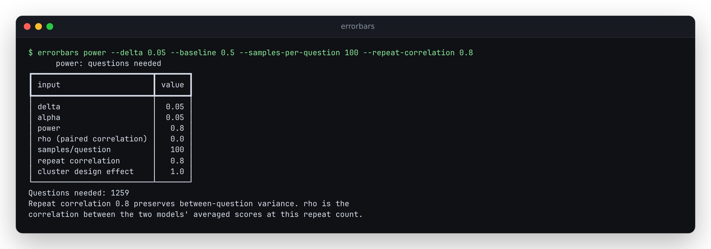

# Planning repeated answers without losing question difficulty

The previous planner turned a 1,570-question design into 16 questions if each
question received 100 answers. It divided all score variance by 100, including
differences between easy and hard questions. A caveat in the formulas document
described this assumption, but the CLI result did not require the user to choose it.

The source checkout now requires `--repeat-correlation` for repeated answers.
This is an unreleased behavior change. The browser calculator still plans one
answer per question; its underlying TypeScript API enforces the new rule too.

## A reproducible budget

From an installed source checkout:

```bash
errorbars power --delta 0.05 --baseline 0.5 --samples-per-question 100 --repeat-correlation 0.8
```

The result is **1,259 distinct questions per model**, with 100 answers each:
251,800 model answers across the comparison. This is an assumed design, not a
measurement of a particular pair of models. Defaults are alpha 0.05, target
power 0.8, pairing correlation 0, and cluster design effect 1.

| Within-question repeat correlation | Questions per model | Meaning |
| ---: | ---: | --- |
| 0 | 16 | Explicit independent-repeat assumption; reproduces the old formula |
| 0.8 | 1,259 | Most variance persists when answers are repeated |
| 1 | 1,570 | Identical repeats cannot replace new questions |
| Omitted | No result | Unknown dependence cannot silently become independence |



With a fixed question budget, the same assumption applies:

```bash
errorbars power --n 500 --baseline 0.5 --samples-per-question 100 --repeat-correlation 0.8 --json
```

## Three different sources of dependence

| Input | What is correlated | Planning meaning |
| --- | --- | --- |
| `--repeat-correlation` | Two answers from one model to the same question | Fraction of single-answer variance that persists under repeated generation |
| `--rho` | The two models' question averages at the requested repeat count | Pairing can reduce the variance of their difference |
| `--cluster-deff` | Different questions in the same passage or group | Inflates uncertainty beyond an independent-question design |

For single-answer variance `V1`, repeat count `k`, and repeat correlation `r`:

```text
V1 = between + within
variance of a question average = between + within/k
                              = V1 * (r + (1-r)/k)
```

This is the law-of-total-variance model in
[Miller (2024), section 3.1](https://arxiv.org/html/2411.00640v1#S3.SS1).
The exact covariance sum gives the same result. The rest of the
[power approximation](formulas.md#11-power-analysis) is unchanged.

`rho` need not stay constant when `k` changes. In the retained public data,
the mean correlation between the models' question scores was 0.296 at one
answer and 0.652 at 100 answers. Treating the first as a measured correlation
for the second design would be a different assumption.

## Using a pilot

Run `errorbars summarize pilot.csv --model MODEL --json` on canonical scores
with distinct `sample` identifiers. When repeated observations exist,
`within_between.var_within` estimates the generation component and
`within_between.var_between` estimates the persistent question component.
Both are in squared score units. For a pilot where their sum is positive:

```python
from errorbars.power import questions_needed

# Illustrative variance components, not a measured model.
between, within = 0.20, 0.05
plan = questions_needed(
    delta=0.05,
    variance=between + within,
    samples_per_question=100,
    repeat_correlation=between / (between + within),
)
assert plan.n_questions == 1259
```

`--variance` is a **single-answer** variance. Do not pass the already-reduced
variance of a question average and then ask to reduce it again. A pilot needs
multiple questions and repeat coverage; constant outcomes or scant coverage
cannot justify a precise budget. Check plausible variance and correlation
ranges. A point estimate's uncertainty is not propagated by this planner.

The [installed-CLI verifier](../scripts/verify_repeat_planning.py) builds a
2,540-row pilot from the first 20 recorded answers to all 127 questions from
one public run. It checks `summarize` against a standard-library calculation,
then checks forward and inverse plans at 1, 10 and 100 answers per question.
These are hypothetical equal-variance comparisons using that pilot, not a
power estimate for the two actual public models.

## Evidence and limits

The [study](../studies/repeated-planning/README.md) retains 2.54 million binary
grading outcomes and SHA-256 hashes for the original downloads. At 100 answers
per question, observed variance was 41-48 times the old independence estimate.
Components fitted on the first 5,000 draws predicted variance in the last
5,000 within 1%, on the **same questions**.

A separate normal random-effects simulation used 20,000 trials per plan.
With repeat correlation 0.8 and 100 answers, the old 16-question design achieved
5.64% power; the repaired 1,259-question design achieved 79.85%. Independent
noncentral-t calculations gave 6.01% and 79.94%. These results validate the
specified simulation model, not arbitrary LLM evaluation designs.

The planner continues to assume equal marginal variances and repeat correlation
for both models, a representative population of independent questions before
any cluster adjustment, and a normal power approximation. Repeat correlation
must lie in [0,1]; designs with negative dependence are outside this model.
Few questions, unequal groups, rare outcomes, or multiple model comparisons
need additional design work. `r=1` is an upper bound on marginal question
variance for fixed `V1`; it is not a universal guarantee about a paired test
with uncertain `rho`.

Repeated draws must use the same generation settings. Adaptive sampling,
majority vote and pass@k change the estimator; this calculation plans the
**mean score across repeated answers**. Published correctness labels were
not independently regraded. No new model inference was run for the study.
