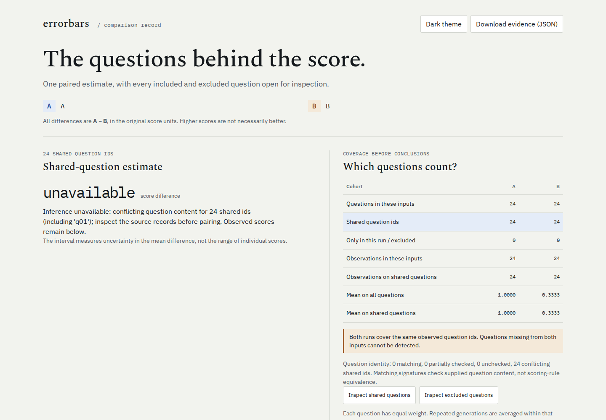

# Inspect comparisons: a question ID is not a question

Two evaluations can reuse every sample ID while asking different questions.
Before this change, Errorbars paired two such Inspect logs and reported a
66.7-point advantage with p = 0.000000644. The source checkout now reports
24 conflicting sample definitions and withholds the paired estimate.

These are **synthetic arithmetic questions and scripted responses**, recorded
through Inspect AI's real local `mockllm/model` provider. They demonstrate an
import/analysis error, not a model-quality result. No paid API or network model
call was used. This improvement is local and unreleased.



## Retained recordings

`capture.py` runs a 24-question addition task and four controlled variations.
The `.eval` files are unedited harness output; the fixed filenames are copies
of the timestamped originals. They were recorded with Inspect AI 0.3.268.
[The manifest](logs/manifest.json) includes SHA-256 digests, selected IDs,
planned/completed/recorded counts and raw score codes. All material in this
example is authored for the project and covered by its MIT license.

| Log | What changes | Recorded observations | Distinct questions |
| --- | --- | ---: | ---: |
| `original.eval` | Scripted correct answers to addition | 24 | 24 |
| `solver-variant.eval` | Adds a solver system prompt; scripted answers correct on every third question | 24 | 24 |
| `different-questions.eval` | Multiplication instead of addition, reusing the same IDs | 24 | 24 |
| `limited.eval` | Completed slice, indices 5 through 16 of the addition dataset | 12 | 12 |
| `selected-epochs.eval` | Three selected addition questions, each run for two epochs | 6 | 3 |

The solver variant has different generated message IDs and a different solver
conversation, but the original dataset input is unchanged. It remains a valid
pairing. The multiplication task changes every input, including the one where
the reference answer coincidentally equals the addition answer.

## Before and after on identical files

The comparison below replays the retained bytes through commit `20437eb` and
the changed source, then repeats the latter with an installed wheel outside the
checkout. Full numeric evidence is in [before-20437eb.json](evidence/before-20437eb.json)
and [after.json](evidence/after.json).

| Compared with original | Before | After |
| --- | --- | --- |
| Solver variant | 24 paired, identity unchecked; p = 6.44449e-7 | 24 matching; same estimate and p-value |
| Different questions | 24 paired, identity unchecked; p = 6.44449e-7 | 24 conflicts; inference unavailable |
| Completed limit | 12 paired; p = 0.000660314 | 12 matching; same estimate and p-value |
| Selected two-epoch run | 3 paired; p = 0.183503 | 3 matching questions, 6 B observations; same estimate and p-value |

`replay.py` also writes four **deliberately damaged copies** of the original:

| Damage | Before | After |
| --- | --- | --- |
| Retain 8 records while header still expects 24 | Imports 8 | Refuses incomplete cohort |
| Set status to cancelled, retaining all scores | Imports 24 | Refuses incomplete run |
| Set completed count to 8, retaining all scores | Imports 24 | Refuses incomplete cohort |
| Rename one record's sole scorer | Pools 24 scores from different criteria | Refuses changing scorer |

The originals in `logs/` are never modified. Damaged copies are created only
in the requested output directory. A conflict report preserves the original
scores, source record indices, epoch numbers and content hashes, without
embedding the prompts or answers.

## Reproduce from this checkout

From the repository root:

```sh
uv sync --locked --group dev
uv run python examples/inspect-comparison/replay.py /tmp/errorbars-inspect-replay
uv run errorbars compare A=examples/inspect-comparison/logs/original.eval B=examples/inspect-comparison/logs/different-questions.eval --html /tmp/errorbars-inspect-replay/conflict.html
```

The last command **intentionally exits 1** after writing the inspectable report.
Open it from disk. To see a valid comparison, substitute `solver-variant.eval`.
To generate new recordings (timestamps and message IDs will differ):

```sh
uv run python examples/inspect-comparison/capture.py /tmp/errorbars-inspect-new
```

The browser check needs the repository's web dependencies and installed
Chromium/Firefox. It opens reports offline, operates question inspectors with
the keyboard, downloads the complete JSON, checks cohort/epoch/conflict counts,
and refuses page errors, network requests or horizontal overflow:

```sh
npm --prefix web ci
node examples/inspect-comparison/check-reports.mjs /tmp/errorbars-inspect-replay
```

[Twelve workflows](evidence/browsers.json) passed on the installed-wheel reports:
three scenarios, two engines, desktop and 375px phone widths. Screenshots show
the [desktop](../../docs/assets/inspect-conflict-1440.png) and
[phone](../../docs/assets/inspect-conflict-375.png) conflict state.

## Scope and tradeoffs

The signature checks the exact recorded text input, ordered choices and targets.
It excludes solver conversations and generated message IDs. Rewriting dataset
input as part of a prompt experiment now conservatively conflicts: review the
underlying-question mapping separately and provide canonical CSV with reviewed
IDs/signatures for that experiment. Equal hashes do not establish equal graders
or representative samples.

Multimodal, tool-history and sandbox/file/setup-backed samples stay explicitly
unchecked. An absent signature still allows ID-based inference with its existing
warning; it is not evidence of matching content. The complete rules and recovery
procedure are in the [comparison guide](../../docs/comparison-reports.md#question-identity).

Completeness uses Inspect's selected run, allowing completed limits and selected
IDs. It refuses partial, failed or early-stopped cohorts instead of silently
choosing the successfully scored subset. It cannot authenticate a log whose
records and metadata have both been consistently rewritten.

See [verification](../../docs/verification-inspect-2026-10-09.md) for install,
compatibility, oracle and browser commands and results. Upstream semantics were
checked against Inspect's [log API](https://inspect.aisi.org.uk/reference/inspect_ai.log.html)
and [log-file documentation](https://inspect.aisi.org.uk/eval-logs.html), as well
as the installed 0.3.268 source and freshly recorded runs.
