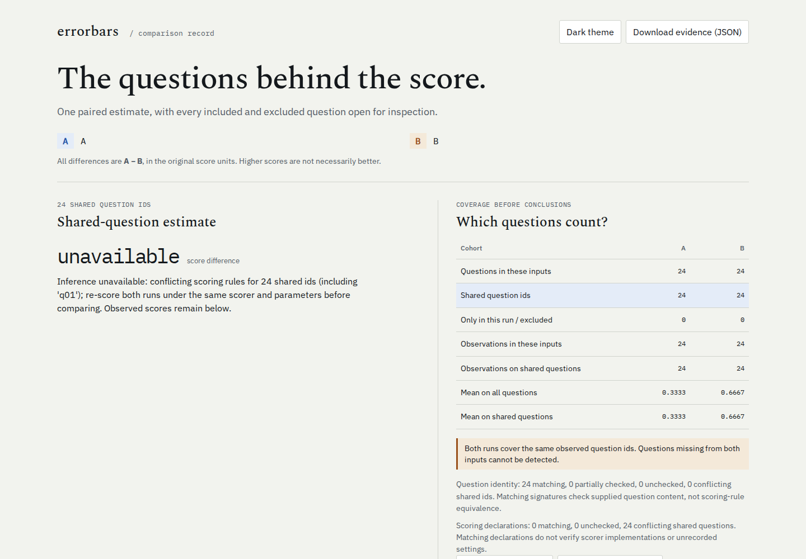

# Same answers, different grader

Errorbars previously reported a **33.3 percentage-point model improvement with
exact McNemar p = 0.0078125** when the answers had not changed. One Inspect log
used `match(location="exact")`; the other used `match(location="any")` on the
same 24 questions and responses. Every question-content check passed.

The source checkout now withholds that comparison, keeps both sets of scores
inspectable, and explains the conflicting scoring declarations. The protection
survives `errorbars import` and canonical CSV export. It also preserves lm-eval
metric names across separately converted files. These changes are available
in source; the verification below concerns a locally built package.



## What was recorded

The five `.eval` files in [logs/](logs/) are unedited Inspect AI 0.3.268 output.
They contain **synthetic arithmetic questions and scripted responses**, generated
through the real local `mockllm/model` provider. They measure importer behavior,
not model quality. No model API or paid service was used. The [manifest](logs/manifest.json)
retains SHA-256 digests, scorer declarations, aggregate results and every scripted
answer and raw grade. These authored examples use the repository's MIT license.

Eight answers are bare correct numbers, eight are correct numbers inside a
sentence, and eight say "I do not know." Exact matching awards 8/24; either
containment rule awards 16/24. The improvement control changes the eight verbose
answers to bare numbers while keeping the exact grader.

| Compared with `exact.eval` | Answers changed? | Grading declaration | At `cdc24d7` | Repaired behavior |
| --- | --- | --- | --- | --- |
| `anywhere.eval` | No | `match`, location `any` | B +33.3 points; p = 0.0078125 | 24 scoring conflicts; inference and ranking refused |
| `includes.eval` | No | `includes` | B +33.3 points; p = 0.0078125 | 24 scoring conflicts; inference and ranking refused |
| `exact-repeat.eval` | No | `match`, location `exact` | Difference 0; p = 1 | Unchanged |
| `improved-exact.eval` | Yes | `match`, location `exact` | B +33.3 points; p = 0.0078125 | Unchanged |

All four pairs have 24 matching question definitions. The eight one-sided
discordances in the improvement control have two-sided exact probability
`2 / 2**8 = 0.0078125`; the regression tests also compare with SciPy's binomial
test. A small p-value cannot repair a changed measurement rule.

The retained [before](evidence/before-cdc24d7.json) and [after](evidence/after.json)
records include implementation file hashes, native and CSV results, leaderboard
behavior and CLI exits on the identical input files. The [browser record](evidence/browsers.json)
covers 16 offline workflows, including downloaded evidence and keyboard inspection.

## Reproduce

From the repository root:

```sh
uv sync --locked --group dev
uv run python examples/inspect-scoring/replay.py /tmp/errorbars-scoring --expect-repaired
uv run errorbars compare A=examples/inspect-scoring/logs/exact.eval B=examples/inspect-scoring/logs/anywhere.eval --html /tmp/errorbars-scoring/conflict.html
```

The final command intentionally exits 1 after writing an inspectable report.
Replace `anywhere.eval` with `improved-exact.eval` for the valid improvement
control. `replay.py` checks file digests and grades against the retained text,
then exercises the library, CLI, ranking and CSV roundtrip. Omit
`--expect-repaired` when replaying an older checkout on these same inputs.

For new captures (timestamps and generated identifiers will differ):

```sh
uv run python examples/inspect-scoring/capture.py /tmp/errorbars-scoring-new
```

To open all four installed-package reports offline in Chromium and Firefox,
check keyboard inspection and export the complete evidence at desktop and phone
widths (uses the repository's browser dependencies and installed browsers):

```sh
npm --prefix web ci
node examples/inspect-scoring/check-reports.mjs /tmp/errorbars-scoring
```

## Recorded declarations, with limits

Inspect records the selected scorer name and its parameters in
[`EvalScore`](https://inspect.aisi.org.uk/reference/inspect_ai.log.html#evalscore).
Errorbars reads the result's declaration, including results produced by Inspect
re-scoring. It hashes the recorded parameter object and retains the selected
name. It excludes aggregate metrics and epoch reducers: this importer reads
individual sample grades and averages repetitions itself.

The fingerprint uses sorted JSON object keys, ASCII escaping, compact separators
and finite numbers, prefixed with `inspect-params-v1:`. Parameter order is ignored;
array order, numeric serialization and string content are exact. Raw parameter
values, which may include private grader prompts, do not enter the report.
The original logs remain the place to inspect the actual settings.

| Evidence | Behavior |
| --- | --- |
| Different known scorer names | Conflict, even if parameters are unavailable |
| Same name, different known parameter fingerprints | Conflict |
| Same name and fingerprint for every observed generation | Matching declarations |
| Missing scorer or parameter evidence on either side | Unchecked, unless other known evidence establishes a conflict |
| Conflicting rules among repeated samples of one model/question | Refused before averaging |

Missing settings never become an empty parameter object. An unknown repeat
cannot erase another repeat's known conflict. Names and explicit parameters
are compared exactly: different aliases or omitted versus explicitly supplied
defaults may conflict even if they happen to behave identically. Re-score under
the same declaration to resolve that conservatism.

Equal declarations **do not verify scorer code, unrecorded defaults, grader-model
versions, external state, or semantic equivalence**. lm-eval samples supply a
metric label, but not a complete scoring implementation/configuration; equal
labels remain unchecked for configuration. Old CSVs without declarations remain
usable with that uncertainty. Arbitrary numeric arrays carry no provenance.

See the [comparison guide](../../docs/comparison-reports.md#scoring-declarations)
for the normalized columns and Python API. Keep both columns when transforming
data. Do not remove conflicts just to get a p-value: select a common scorer and
re-score the original answers.
