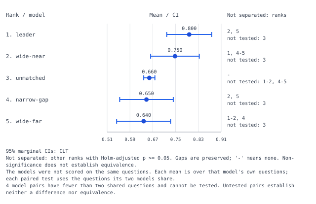

# Rank gaps and unavailable comparisons

This deliberately constructed CSV has four models on 100 binary questions,
plus one model on two separate continuous-score questions. It demonstrates
why a range of ranks cannot stand in for individual paired comparisons.

```sh
errorbars leaderboard examples/leaderboard-ranks/gaps.csv
errorbars leaderboard examples/leaderboard-ranks/gaps.csv --json --plot /tmp/ranks.svg
```

The leader scores 0.80. Its comparisons after Holm correction over the six
tested pairs are:

| Other rank | Model | Holm p | Conclusion at alpha=0.05 |
|---|---|---:|---|
| 2 | wide-near | 0.9991 | No significant difference detected |
| 3 | unmatched | unavailable | No shared questions |
| 4 | narrow-gap | 0.0003662 | Significant difference |
| 5 | wide-far | 0.1656 | No significant difference detected |

The exact display is **`2, 5`**, with **`3` not tested**. A range `1-5`
would incorrectly fill in both a significant comparison and an unavailable
one. Self is excluded from the new display because it is not a comparison.
This is a logical counterexample, not empirical model-performance evidence.



The model on separate questions has no tested comparison. Its apparent
rank reflects its own question mean; it provides no evidence that it is
better or worse than the other models. The warning is present in CLI, JSON,
and the SVG itself. Non-significance is not equivalence, and the rows in
this plot show marginal CIs, not intervals on paired differences.

The [public-data audit](../../studies/leaderboard-ranks/README.md) shows the
range error also occurred on retained real SWE-bench submissions.
