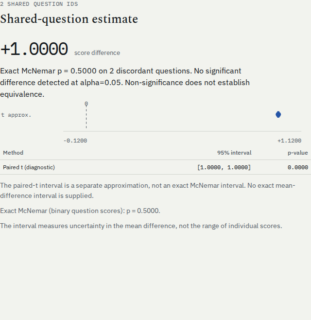
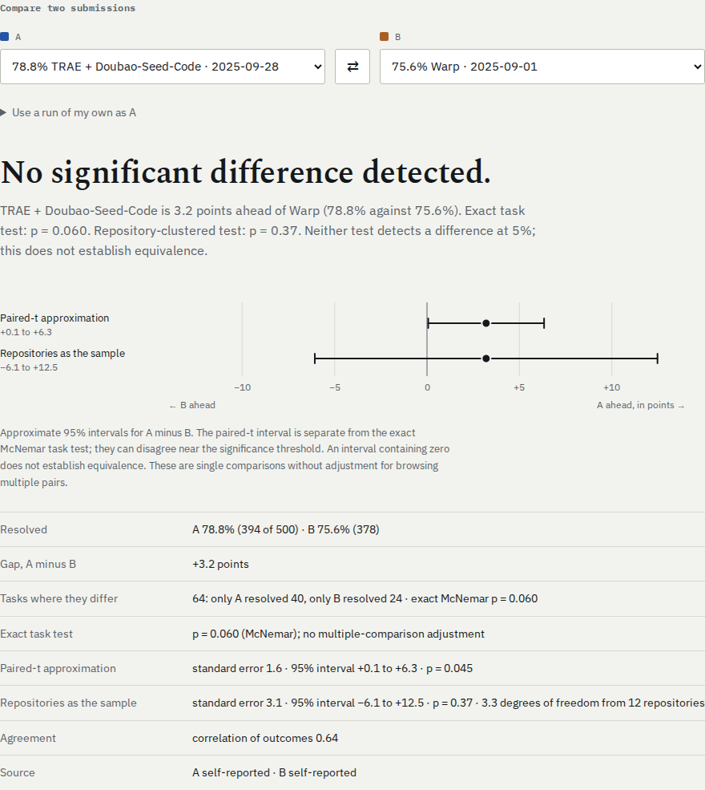

# Select the test before stating the conclusion

Two binary wins on two questions used to produce a standalone report headed
`95% paired CI [1,1]; p=0`. Its exact McNemar calculation was already 0.5,
but appeared only as a secondary diagnostic. The selected headline now uses
that exact binary test. The paired-t approximation remains explicitly labeled.



The selection policy is shared with `leaderboard`: clustered t takes priority
when shared questions are grouped; otherwise one binary observation per shared
question selects exact McNemar, and continuous or repeated-generation question
means select paired t. Counts on unmatched questions cannot change the selected
test. Binary repeated-generation means do not become Bernoulli trials.

The numeric `paired_compare` API is unchanged. CLI JSON preserves its existing
`p_value` and CI fields as paired-t diagnostics and adds `inference`. Report
JSON also adds `inference`; it is null when inference is unavailable. For exact
McNemar, `inference.ci_low`, `ci_high`, and `confidence` are null because no exact
mean-difference interval is implemented. The paired-t interval is not presented
as the exact test's confidence interval. `mcnemar_applicable=false` marks a
legacy binary-mean diagnostic that must not be treated as independent trials.

## Evidence from actual retained outcomes

The two real lm-eval COPA captures contain 20 questions: A alone wins 6, B alone
wins 2, and 12 agree. Directly enumerating the two-sided Binomial(8, 0.5) tail
gives **0.2890625**. The old paired-t diagnostic is 0.16255. The installed CLI,
HTML headline and downloaded browser evidence now agree on the exact result.
The models are tiny test models, not a performance recommendation.

On the [retained SWE-bench snapshot](../swe-bench-verified/README.md), the browser
headline previously used the paired-t p-value despite displaying the exact
McNemar result elsewhere. **102 of 14,878 single pair decisions** differ at
alpha=0.05 between those tests. The browser now uses the exact task test and
reports the repository-clustered result separately. The original study figures
remain labeled as paired-t approximations.

One real counterexample is `20250928_trae_doubao_seed_code` against
`20250901_warp`: 40 tasks are resolved only by A, 24 only by B. The paired-t
p-value is **0.0453913**, while exact McNemar is **0.0599412**. The repository
model gives p about 0.37. The current headline detects no significant difference.



These are single comparisons without Holm correction. They are distinct from
the [leaderboard rank-display audit](../leaderboard-ranks/README.md), which
checks the display of already Holm-corrected decisions. Treating tasks as
independent and treating repositories as independent make different assumptions;
neither a non-significant p-value nor a wide interval proves equivalence.

## Reproduce and inspect

```sh
uv sync --locked --group dev --extra all
uv run python studies/comparison-inference/audit.py
uv build
uv venv --python 3.10 /tmp/inference-wheel
uv pip install --python /tmp/inference-wheel numpy==1.24.0 dist/errorbars-0.2.4-py3-none-any.whl
/tmp/inference-wheel/bin/python studies/comparison-inference/verify-installed.py \
  --executable /tmp/inference-wheel/bin/errorbars \
  --artifacts /tmp/inference-artifacts --out /tmp/inference-workflows.json
```

The [public-data audit](audit.py) derives discordance counts directly from the
retained outcome bit masks and checks every selected p-value against
[SciPy's binomial test](https://docs.scipy.org/doc/scipy/reference/generated/scipy.stats.binomtest.html).
Maximum absolute error is 1.44e-15. [Results and all changed pairs](results.json).
The [installed replay](verify-installed.py) separately reads native lm-eval
records and computes the small exact tail with standard-library integer binomial
coefficients. It also checks clustered, repeated and two-win cases.
[Retained installed results](installed.json).

For browser verification, run `npm ci` in `web`, with Playwright Chromium and
Firefox installed. `npm run test:browser` exercises the production build, while
`ERRORBARS_REPORT_PYTHON=/tmp/inference-wheel/bin/python npm run test:reports`
checks standalone files generated by the installed wheel, with networking
disabled. The reports are exercised at desktop and phone widths and their JSON
downloads checked against the headline.

With a built site served locally, the additional inspectable captures come from:

```sh
node studies/comparison-inference/check-artifacts.mjs \
  /tmp/inference-artifacts http://127.0.0.1:4201/errorbars/
```

[Browser measurements](browsers.json) retain actual text at 1440 and 375 pixels
in Chromium and Firefox. These images are captures of the real outputs, not
mockups. No new model calls were made for this repair.
