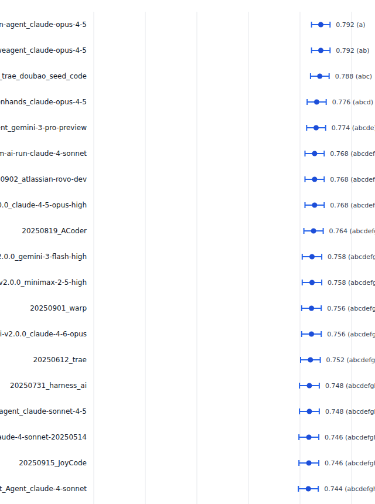
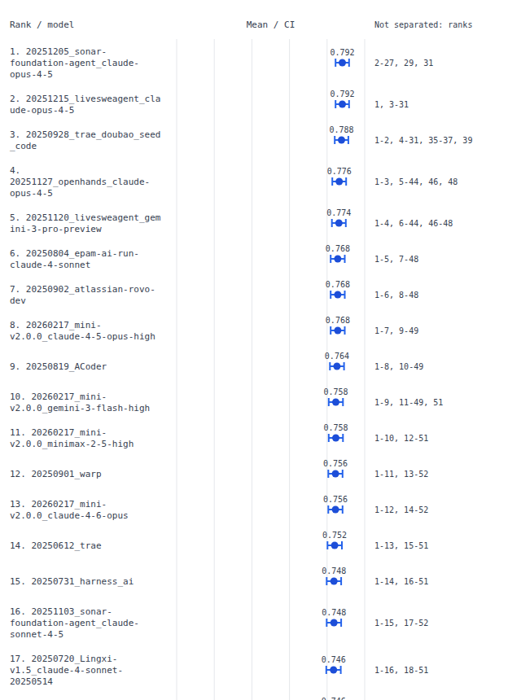

# Exact rank evidence on a public leaderboard

The previous CLI compressed overlapping non-significant groups to each
model's minimum and maximum rank. On the retained 173-submission SWE-bench
Verified data, that shortcut implied **150 directed ties that the selected
tests called significant**, affecting 77 models. Correct p-values were already
present in JSON; the display contradicted them.

The top submission's previous label was `1-31`. Its exact non-significant
other ranks are **`2-27, 29, 31`**. Rank 28 has Holm p=0.03530 and rank 30
has p=0.02806, both below 0.05. Paired differences depend on the joint outcomes,
so sorting model means does not make these sets contiguous.

| Scenario | Models | Tested pairs | Prior false directed ties | Corrected |
|---|---:|---:|---:|---:|
| Tasks treated as independent | 173 | 14,878 | 150 | 0 |
| Questions grouped by repository | 173 | 14,878 | 0 | 0 |

The clustered scenario previously used two group letters rather than rank
spans, so it did not exhibit the terminal range bug. Both scenarios now use
exact ranks. These are distinct analysis assumptions; this audit does not
claim that SWE-bench tasks are independent or that a non-significant result
establishes equivalence. It changes no means, intervals, tests, adjusted
p-values, or maximal cliques.

The input is the [retained study](../swe-bench-verified/README.md)'s snapshot
of public outcome lists from SWE-bench/experiments commit
`40f164d5b8f1d249bf95a6df8b74b577fd8e519d`. The same exclusions for inconsistent
reported scores are retained. No new submissions, model calls, or benchmark
question text are downloaded. [Results](results.json) retain the source
hash, baseline revision, unchanged-analysis hashes and every affected model.

## Standalone plots

The previous SVG also clipped names and group labels. Actual Chromium
rendering clipped 228 text elements on this board (Firefox: 195).
The repaired SVG wraps names and exact rank lists, expands rows as needed,
and labels untested comparisons separately. All 173 rows and all text
bounds were checked in each browser: **zero clipped text elements and
zero overlapping rows**. [Measurements](browsers.json).

These are actual browser captures of the first 860 pixels of each 640-pixel
wide SVG, not illustrations. Full exports are generated by the replay.

| Previous export | Corrected export |
|---|---|
|  |  |

## Reproduce

```sh
uv sync --locked --group dev --extra all
uv run python studies/leaderboard-ranks/audit.py --artifacts /tmp/rank-audit
uv run errorbars leaderboard examples/leaderboard-ranks/gaps.csv --json \
  --plot /tmp/rank-audit/gaps.svg > /tmp/rank-audit/gaps.json
node studies/leaderboard-ranks/check-plots.mjs /tmp/rank-audit
```

The browser check uses the existing `web/node_modules/playwright` dependency
and installed Chromium/Firefox engines. It opens the files offline. The audit
loads the baseline implementation from commit `6af9d95`, compares all original
analysis fields exactly, then independently expands every rendered rank range
and checks it against actual pairwise decisions. Baseline source must therefore
be available in git history.

For an installed-wheel replay, including a bare Python 3.10 / NumPy 1.24
environment with no Rich:

```sh
uv build
uv venv --python 3.10 /tmp/rank-wheel
uv pip install --python /tmp/rank-wheel numpy==1.24.0 dist/errorbars-0.2.4-py3-none-any.whl
/tmp/rank-wheel/bin/python studies/leaderboard-ranks/verify-installed.py \
  --executable /tmp/rank-wheel/bin/errorbars --artifacts /tmp/rank-audit
```

That replay checks the actual plain-text counterexample, all 29,756 pairwise
results across the two public-board scenarios, exact decision sets, and
byte-identical SVGs. Large generated CSV/JSON/SVG files stay in the specified
temporary directory; only the compact audit and inspected screenshots are
retained here.
