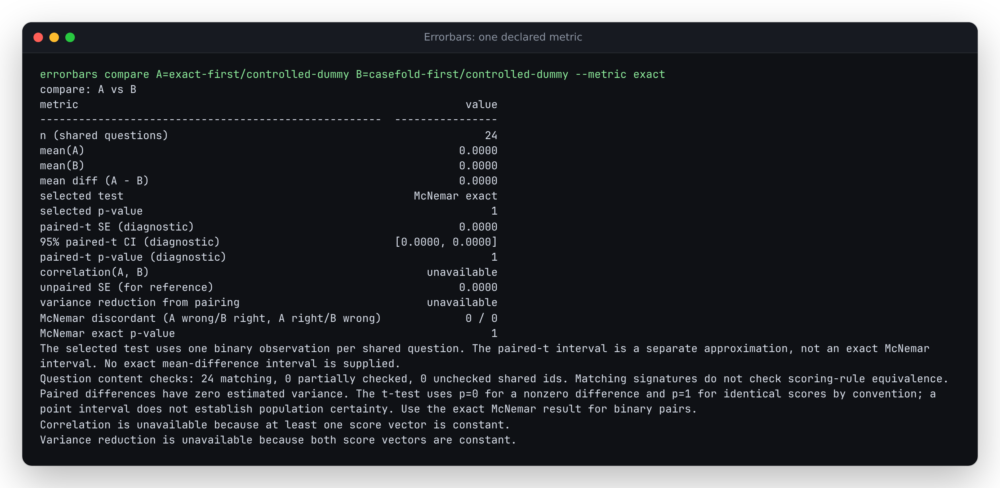

# A metric list is not a choice of score

The baseline checkout (`913a5ec`) could compare identical answers as a 100-point
improvement. Its lm-eval reader selected the first item in each record's
`metrics` list. Two files could therefore supply different score definitions
without the caller choosing either one. It also accepted numeric metadata as
scores and inferred model names from an unrelated results file.

The source correction is unreleased. Native logs with several metrics
now require `--metric`. A selected metric must be declared on every selected
record; it cannot switch between questions. `load_inputs` refuses different
metric names for shared question IDs across native lm-eval logs. Automatic
model attribution requires a results file with the same timestamp. `NAME=PATH`
or `--model` still explicitly names orphaned or renamed samples.

## Actual harness capture

[`capture.py`](capture.py) ran **lm-eval 0.4.13** twice on 24 constructed
questions. Its real `DummyLM` always replies `lol`; the requested answer is
`LOL`. Our exact scorer reports 0 and our case-insensitive scorer reports 1.
The second run changes only the insertion order of these two score keys.
The questions, targets, prompts, responses and numeric scores are identical,
which the replay verifies directly against both JSONL files.

The committed [`captures/`](captures/) contain the harness's unedited sample
and result files. This is a controlled software experiment, with no model
weights, downloaded dataset, remote inference, or claim about model quality.
The 24 questions are not independent empirical evidence of an improvement;
that is precisely why comparing different score columns would be misleading.

| Actual CLI workflow | Baseline | Corrected checkout |
| --- | --- | --- |
| Compare the two captures without a metric | A 0%, B 100%; exact McNemar p = 0.0000001192092896 | Error naming both metrics; no report |
| Compare with `--metric exact` | Zero difference; p = 1 | Zero difference; p = 1 |
| Compare with `--metric casefold` | Zero difference; p = 1 | Zero difference; p = 1 |
| ARC fixture with `--metric doc_id` | Mean score 2.0 from question IDs 0 through 4 | Error: field is not a declared metric |
| Tiny GPT-2 COPA samples beside another run's results | Mislabelled as `hf-internal-testing/tiny-random-gpt2` | Error requiring an explicit name |
| Same samples with matching results | `sshleifer/tiny-gpt2`, mean 0.6 | Unchanged |

[Before](results/before.json) and [after](results/after.json) retain twelve CLI
commands, stdout, stderr, exit codes and input hashes. Eight cases expose the
old selection behavior; four check explicit choices and correct metadata.
Two cases are **derived controls**, not new native captures: narrowing declared
metrics differently across files, and switching the single declared metric
halfway through a file. The existing ARC and two-model COPA fixtures retain
their original provenance under `tests/fixtures/`.

## Reproduce and migrate

From a checkout with `uv sync --locked --group dev --extra all`:

```bash
uv run python studies/lm-eval-evidence/replay.py --src src --out /tmp/after.json
uv run errorbars compare \
  A=studies/lm-eval-evidence/captures/exact-first/controlled-dummy \
  B=studies/lm-eval-evidence/captures/casefold-first/controlled-dummy \
  --metric exact --json
```

The second command compares the same chosen score and returns a zero difference.
Omit `--metric exact` to reproduce the actionable rejection (exit 1). The
single-metric COPA quickstart remains automatic. For real ARC logs select
`--metric acc` or `--metric acc_norm` according to the experiment, not according
to which produces the larger gap. A moved sample file can be named with
`errorbars summarize my-model=path/to/samples.jsonl --metric acc`.

To inspect the old behavior without changing your checkout:

```bash
mkdir -p /tmp/claude-1000/errorbars-selection-before
git archive 913a5ec src | tar -x -C /tmp/claude-1000/errorbars-selection-before
uv run python studies/lm-eval-evidence/replay.py \
  --src /tmp/claude-1000/errorbars-selection-before/src \
  --out /tmp/before.json --observe-only
```

To generate a fresh capture, use a separate environment with
`lm-eval==0.4.13`, then run `python capture.py --out /path/to/new-captures`.
Package installation needs network access; capture generation and replay do
not. Replays normally use the committed capture files. Do not append a fresh
capture into their directories: the filenames identify a particular run.

## Boundaries

Matching metric names do not prove identical scoring implementations, task
versions, or filter settings. Comparing intentional filter or prompt changes
remains supported. The cross-file metric check applies to native lm-eval inputs
loaded together through `load_inputs` (including all CLI analysis/import commands).
Canonical CSV exports retain scores and question signatures but do not carry
this metric declaration; callers supplying CSVs or direct score arrays must
establish score comparability themselves. A matching filename timestamp is
run association, not cryptographic proof of authenticity.

The upstream evaluator records each `process_results` key in `metrics`; it does
not designate the first as the preferred score. The tracker uses one date ID
for the samples and results filenames. These behaviors were inspected in the
pinned [evaluator](https://github.com/EleutherAI/lm-evaluation-harness/blob/v0.4.13/lm_eval/evaluator.py)
and [tracker](https://github.com/EleutherAI/lm-evaluation-harness/blob/v0.4.13/lm_eval/loggers/evaluation_tracker.py).

## Verification of the local change

The clean export of code commit `29dd1ec` passed a fresh locked install, Ruff,
strict mypy, all **566 tests**, and wheel/source-distribution builds. The twelve
CLI workflows also passed from installed wheels on **Python 3.14.7 / NumPy 2.5.3**
and the declared minimum **Python 3.10.21 / NumPy 1.24.0**. Those environments
contained only the wheel and NumPy; the replay cleared `PYTHONPATH`.
[Installed current](results/installed.json) and
[installed minimum](results/installed-minimum.json) retain the actual outputs.



The terminal screenshot was rendered from the unedited installed CLI output in
[`lm-eval-selection.ansi`](../../docs/assets/lm-eval-selection.ansi) and visually
checked. No web UI was changed. The existing web build command remains
`cd web && npm run build`, producing `web/dist/`; it was not redeployed.
These checks use the corrected source and locally built wheels, not a new PyPI
release. They do not establish the version served by the hosted calculator.
