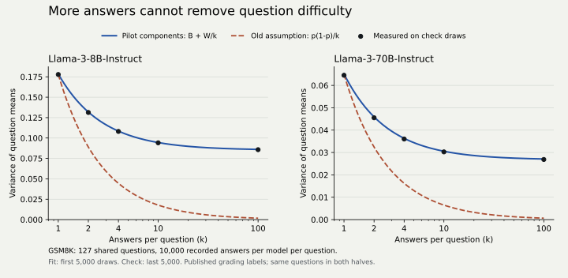

# Repeated answers reach a variance floor

At 100 answers per question, the former `V/k` planning assumption understated
the measured question-level variance by **48.19 times** in one public model
run and **41.42 times** in another. The repaired planner retains the component
that comes from differences between questions. This study checks that repair
with public outcomes and a separate simulation whose power can be computed
independently.



## Public outcomes

The data comes from Brown et al. (2024),
[Large Language Monkeys: Scaling Inference Compute with Repeated Sampling](https://arxiv.org/abs/2407.21787),
via the [pinned Monkey Business dataset](https://huggingface.co/datasets/ScalingIntelligence/monkey_business/tree/a9f8f73bcd6948a57ed922cba4e48062ef95f553).
We downloaded the GSM8K Llama-3-8B-Instruct and Llama-3-70B-Instruct files.
Each contains 10,000 answers to each of 127 test questions, with published
binary `is_corrects` labels. These are recorded model generations, not
synthetic examples produced by Errorbars. No model inference was run here.

The [dataset card](https://huggingface.co/datasets/ScalingIntelligence/monkey_business/blob/a9f8f73bcd6948a57ed922cba4e48062ef95f553/README.md)
describes temperature 0.6, five few-shot examples, and regex-extracted numeric
answers compared with the supplied targets. We use the labels as published
and do not independently regrade the answers.

`fetch.py` verifies the complete source SHA-256 digests against pinned LFS
object hashes, checks counts and binary types, and retains only labels,
question IDs, original record indices, and hashes of question/target text.
The two models have matching IDs and question/target hashes. The compressed
outcome artifact is 165,985 bytes; it preserves all 2,540,000 labels and their
source ordering. It contains no question, prompt, or answer text.
[Manifest](manifest.json), [data notice](NOTICE.txt).

For each model, we fit a balanced variance decomposition on draws 0-4999:

```text
W = mean of the 127 within-question sample variances
B = max(0, sample variance of the 127 question means - W/5000)
r = B / (B + W)
```

For each repeat count `k`, draws 5000-9999 form disjoint blocks of `k`
answers. We average answers within a question, compute sample variance
across the 127 questions for every block, then average those variances.
The check half is not used to fit `B` or `W`.

| Model | Fitted repeat correlation | Observed variance at k=100 | Old p(1-p)/100 | Pilot B+W/100 | Prediction error |
| --- | ---: | ---: | ---: | ---: | ---: |
| Llama-3-8B-Instruct | 0.4768 | 0.085715 | 0.001779 | 0.086049 | +0.39% |
| Llama-3-70B-Instruct | 0.4103 | 0.026885 | 0.000649 | 0.027104 | +0.81% |

All rows at `k = 1, 2, 4, 10, 100` are in [results.json](results.json).
The old formula is nearly right at `k=1`; its error grows with repeats.
The paired correlation between the two models' question averages also changes:
0.296 at one answer versus 0.652 at 100 answers. A pairing assumption measured
at one repeat count cannot automatically be reused at another.

This is a split of **draws on the same questions**, not a validation on new
questions or a population power estimate. Both generation-order halves may
share biases. There are only two model runs, and the two models have different
variances; this table does not claim that an equal-variance planner exactly
describes their comparison. The model plans average scores, not pass@k or voting.

## Controlled power check

The simulation samples independent normal question effects and generation noise
for two hypothetical models with the same single-answer variance 0.25. Their
mean difference is 0.05, pairing correlation is 0, and there is no passage
clustering. Each plan targets 80% power at a two-sided 5% level. For each trial
we perform a paired t-test on the question averages using their estimated SD.

The old budget is computed directly from the original `V/k` formula. The
repaired budget comes from `questions_needed`. Simulation draws the question
and generation components separately; the mean of normal generation noise
uses its exact normal distribution. An independent SciPy noncentral-t
calculation checks achieved power. There are 20,000 trials per plan, with
fixed seeds and bounded batches. Monte Carlo standard errors are retained.

| Repeats | Repeat correlation | Old questions | Old empirical power | Repaired questions | Repaired empirical power |
| ---: | ---: | ---: | ---: | ---: | ---: |
| 10 | 0 | 157 | 79.77% | 157 | 79.68% |
| 4 | 1/3 | 393 | 50.89% | 785 | 80.20% |
| 100 | 0.8 | 16 | 5.64% | 1,259 | 79.85% |
| 100 | 1 | 16 | 5.85% | 1,570 | 80.28% |

The independent noncentral-t power for the third row is 6.01% at the old
budget and 79.94% at the repaired budget. The remaining gap from the
requested 80% reflects the normal planning approximation and Monte Carlo
variation. This is validation under the specified simulation model, not
a claim about achieved power on the public GSM8K models.

The analytic regression checks also use the uniform-difficulty example in
[Miller (2024), section 3.1](https://arxiv.org/html/2411.00640v1#S3.SS1),
where between-question variance is 1/12 and generation variance is 1/6.

## Reproduce

From the repository, with its locked development environment:

```bash
uv sync --locked --group dev --extra all
uv run python studies/repeated-planning/analyze.py
uv run python studies/repeated-planning/figures.py
```

The analysis needs only the committed `outcomes.json.gz`; it verifies its
compressed and uncompressed manifest hashes before use. `figures.py` creates the standalone SVG and PNG
from the retained results. To regenerate the outcomes, run
`uv run python studies/repeated-planning/fetch.py`; this downloads about
701 MB into ignored `cache/`, verifies each source hash and rewrites the
small derived artifact. It never executes generated answers.

```bash
uv run python scripts/verify_repeat_planning.py --out /tmp/repeat-workflows.json
```

The last command checks the actual CLI, including missing-assumption refusals,
JSON fields and a 2,540-row pilot built from real recorded outcomes. Supply
`--executable /path/to/installed/errorbars` to verify a built wheel. Retained
[workflow output](workflows.json) includes the input digest and every plan;
the [user guide](../../docs/repeated-planning.md) explains its assumptions.
