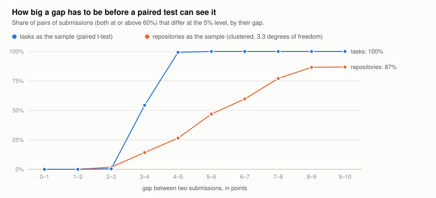
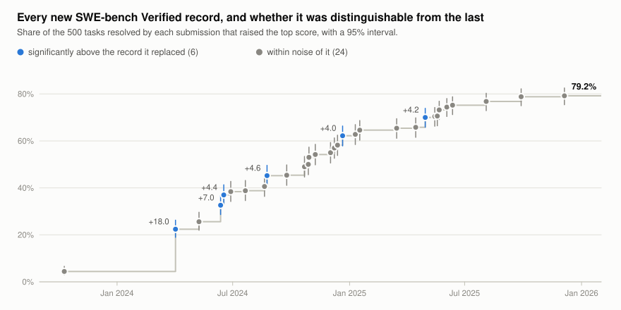

# SWE-bench Verified, with error bars

SWE-bench Verified scores are quoted to a tenth of a point: 79.2%, 78.8%, 77.6%.
Every submission also publishes *which* of the 500 tasks it resolved, so the
question "is 79.2 really better than 77.6?" has a checkable answer. This study
runs `errorbars` over all 173 usable submissions in the public
[SWE-bench/experiments](https://github.com/SWE-bench/experiments) repository
and reports what the leaderboard's differences are worth.

**What comes out**

- **A gap under 3 points is below what this benchmark can detect.** Among the 78
  submissions scoring 60% or more, 1 of the 874 pairs less than 3 points apart
  differs at the 5% level. The paired standard error of a gap is 1.8 points at
  the median (1.5 to 2.1 for nine pairs in ten), so a gap needs to be about 3 to 4
  points to show. Between 3 and 4 points 54% of pairs differ; above 4.2 points
  every pair does. The 3,003 pairs share 78 submissions and are not independent.
- **The top of the board is one group.** Two submissions tie for the lead at
  79.2%. The leader is not distinguishable from ranks 2 to 9 (down to 76.4%);
  rank 2 is the tie. Of the leader's 24 comparisons with ranks 2 to 25, 16 differ
  before correcting for the number of comparisons and 7 after (Holm; ranks 16, 17
  and 21 to 25). None of the 49 adjacent pairs in the top 50 differ. Of the 190
  pairs in the top 20, 32 differ before correcting and none after.
- **Most new records were not distinguishable from the record they replaced.**
  The top score went up 30 times between October 2023 and December 2025. Six of
  those steps were significant.
- **For claims about other codebases, the benchmark is a handful of data points.**
  Its 500 tasks come from 12 repositories and 231 of them are Django. Treating
  repositories as the sample leaves 3.3 effective degrees of freedom; the
  leader's interval widens from 75.4–82.5 to 70.0–88.4.

None of this says progress on the benchmark is not real: the same data go from
4.4% to 79.2%. It says which comparisons the benchmark can carry, and neighbours
on the leaderboard are not among them.

<picture>
  <source media="(prefers-color-scheme: dark)" srcset="figures/leader-dark.svg">
  
</picture>

## Data

`fetch.py` reads the per-task outcome lists at one pinned commit of
SWE-bench/experiments (`40f164d`, 3 September 2026) and packs them into
[`data/outcomes.json`](data/outcomes.json): one record per submission with its
500 outcomes and the leaderboard's own metadata tags.

| | |
|---|---|
| Submission directories under `evaluation/verified` | 182 |
| Without a per-task outcome file | 7 |
| Per-task file contradicts the submission's stated score (41 of the 175 state one) | 2 |
| **Analysed** | **173** |
| of which marked as checked by the SWE-bench team | 53 |

The two contradictions are worth knowing about if you use this repository
yourself: `20260226_mini-v2.0.0_gemini-3-pro-high` states 69.6% and its
`per_instance_details.json` marks all 500 tasks unresolved;
`20250720_mini-v0.0.0-claude-3-7-sonnet-20250219` states 52.8% and its file
resolves 51 tasks (10.2%). Both are left out. The other 134 submissions state no score in their metadata, so
their per-task files could not be checked this way. One run
(`20260901_mini-v2.4.2_gemini-3-5-flash`) reports 441 of the 500 tasks; the
other 59 count as unresolved, as on the leaderboard.

A score here is the share of the 500 tasks resolved. A "point" is one percentage
point, five tasks. All tests are two-sided at 5%.

## One score

A score of 79.2% on 500 tasks has a 95% interval of 75.4% to 82.5% (Wilson), 3.8
points below and 3.3 above, before anything else is considered. That interval answers
"what would this system score on another 500 tasks like these?".

## Two scores

Comparing two intervals is the wrong test: both systems were run on the same
tasks, and what one finds hard the other mostly does too (the median correlation
between two strong submissions' outcomes is 0.63). A paired test uses that. Its
standard error for the difference between two strong submissions is 1.8 points
at the median (1.5 to 2.1 for nine pairs in ten), so the gap has to be about
twice that.

<picture>
  <source media="(prefers-color-scheme: dark)" srcset="figures/gaps-dark.svg">
  
</picture>

All 3,003 pairs among the 78 submissions at 60% or above:

| Gap (points) | Pairs | Differ, tasks as the sample | Differ, repositories as the sample |
|---|---:|---:|---:|
| 0–1 | 300 | 0.0% | 0.0% |
| 1–2 | 296 | 0.0% | 0.0% |
| 2–3 | 278 | 0.4% | 1.8% |
| 3–4 | 267 | 54.3% | 14.2% |
| 4–5 | 287 | 99.3% | 26.5% |
| 5–6 | 262 | 100.0% | 47.0% |
| 6–7 | 211 | 100.0% | 59.7% |
| 7–8 | 179 | 100.0% | 77.1% |
| 8–9 | 179 | 100.0% | 86.6% |
| 9–10 | 159 | 100.0% | 86.8% |
| 10 or more | 585 | 100.0% | 94.4% |

The smallest gap that was significant is 2.8 points; the largest that was not is
4.2. These are single comparisons, each at 5%, and they are not independent: the 3,003
pairs are made from 78 submissions, and several come from the same group. Someone
reading a leaderboard is making many comparisons at once, and a correction for that
(Holm) raises the bar further: it is why none of the top 20's 190 pairs survive.

Two submissions with the same agent and the same model show how much of this is
the run rather than the system. Claude 4.5 Sonnet under mini-SWE-agent 1.13.3
(70.6%) and under 2.0.0 (71.4%) disagree on 64 of the 500 tasks. GPT-5 mini under
1.7.0 (59.8%) and 2.0.0 (56.2%) disagree on 84. These are not pure repeats, since
the scaffold version changed, but a paired standard error of 1.6 to 1.8 points is
what that much disagreement produces, and it is the same size as the standard
error between two different top systems.

## The record

<picture>
  <source media="(prefers-color-scheme: dark)" srcset="figures/records-dark.svg">
  
</picture>

Ordering the submissions by their own date and keeping each one that beat
everything before it gives 31 record holders and 30 new records. Each new record
was compared with the one it replaced, on the same 500 tasks:

- 6 of 30 were significantly higher (paired t-test; the exact McNemar test agrees
  on all six): +18.0, +7.0, +4.4, +4.6, +4.0 and +4.2 points.
- The other 24 gained 0.2 to 3.6 points, a median of 1.2.
- No step after the 30 April 2025 record (70.0%) has been significant. The eight records after it
  (70.4, 70.6, 73.2, 74.4, 75.2, 76.8, 78.8, 79.2) are each not significantly above
  the one before, and together they add 9.2 points, which is not in doubt
  (p < 0.0001 for 79.2 against 70.0). Four of the six significant steps have
  p between 0.018 and 0.035 with no correction for 30 tests.

Dates are each submission's own. The benchmark was published in August 2024 and
earlier systems were scored on it afterwards, so the first few "records" are
retrospective, and the order in which entries appeared on the public leaderboard
may differ.

## Same scaffold, different models

Most leaderboard entries differ in model, scaffold, prompts and number of
attempts at once. One batch does not: eleven models run under mini-SWE-agent
2.0.0, the benchmark's own bash-only setup, all dated 17 February 2026. The
repository lists 13 mini-SWE-agent 2.0.0 entries; one has no outcome file
(`gpt-5-2-codex`) and one is the Gemini 3 Pro entry excluded above, which leaves
these 11. This is
the table
`errorbars leaderboard` prints for it. Models that share a letter are not
distinguishable after Holm correction over all 55 pairs (24 pairs differ after
correction, 34 before).

| Model | Resolved | 95% interval | Group |
|---|---:|---:|---|
| Claude 4.5 Opus (high) | 76.8 | 73.1–80.5 | a |
| Gemini 3 Flash (high) | 75.8 | 72.0–79.6 | abc |
| MiniMax M2.5 (high) | 75.8 | 72.0–79.6 | ac |
| Claude 4.6 Opus | 75.6 | 71.8–79.4 | abc |
| GLM 5 (high) | 72.8 | 68.9–76.7 | abcd |
| GPT 5.2 (high) | 72.8 | 68.9–76.7 | abcd |
| Claude 4.5 Sonnet (high) | 71.4 | 67.4–75.4 | bcd |
| Kimi K2.5 (high) | 70.8 | 66.8–74.8 | bde |
| DeepSeek V3.2 (high) | 70.0 | 66.0–74.0 | de |
| Claude 4.5 Haiku (high) | 66.6 | 62.5–70.7 | e |
| GPT 5 mini | 56.2 | 51.9–60.5 | f |

Read as a ranking, this table has eleven places. Read with its uncertainty it has
about three levels: six models from 72.8 to 76.8 that cannot be told apart, a
middle that overlaps both neighbours, and GPT 5 mini clearly below.

## Twelve repositories

| Repository | Tasks | | Repository | Tasks |
|---|---:|---|---|---:|
| django/django | 231 | | pydata/xarray | 22 |
| sympy/sympy | 75 | | pytest-dev/pytest | 19 |
| sphinx-doc/sphinx | 44 | | pylint-dev/pylint | 10 |
| matplotlib/matplotlib | 34 | | psf/requests | 8 |
| scikit-learn/scikit-learn | 32 | | mwaskom/seaborn | 2 |
| astropy/astropy | 22 | | pallets/flask | 1 |

Everything above treats the 500 tasks as the sample, which supports statements
about more tasks *from these repositories in this mix*. What people usually want
from a coding benchmark is a statement about other codebases. For that, the
repositories are the sample and the tasks inside one are correlated draws: the
leader resolves 95% of the pytest tasks and 40% of the pylint ones. Across the 78
strong submissions the intraclass correlation by repository has a median of
0.043, small, but with a cluster of 231 it makes the repository-level standard
error of a score 1.5 times the binomial one.

The larger cost is in degrees of freedom. A clustered estimate of a mean rests on
the cluster sums; twelve equal clusters would give 11 degrees of freedom. With
one cluster holding 46% of the tasks the estimate rests mostly on how that one
compares with the rest, and the Satterthwaite approximation gives **3.3**. The
95% critical value is then 3.01, not 1.96. That is the second column of the table
above: a 4 to 5 point gap, always significant with tasks as the sample, is
significant for 27% of pairs with repositories as the sample.

### What this did to the library

Before this study `errorbars` computed clustered intervals the way most packages
do: the CR1 sandwich estimator with a t distribution on G − 1 degrees of freedom.
On this benchmark's repository sizes that test is wrong in the unsafe direction.
The simulation in `analyze.py` draws paired outcomes in which no system is better
on average over repositories and counts how often each test says otherwise at
the 5% level (20,000 draws per row):

| Spread of true per-repository advantage | Tasks as the sample | CR1, t(11) | CR2, Satterthwaite t(3.3) |
|---|---:|---:|---:|
| none | 5.1% | 9.7% | 3.0% |
| 2 points | 9.1% | 11.5% | 3.6% |
| 4 points | 21.6% | 13.9% | 4.4% |
| 8 points | 45.3% | 16.6% | 5.2% |

CR1 rejects two to three times too often, with or without a repository effect:
fitting the mean shrinks the dominant cluster's residual sum, so the variance is
biased down by about 19% here, and 11 degrees of freedom is far too many. The
task-level test is exact when repositories do not matter and badly wrong when
they do. `errorbars` now uses the bias-reduced CR2 estimator with Satterthwaite
degrees of freedom (Bell & McCaffrey 2002; Imbens & Kolesár 2016; Pustejovsky &
Tipton 2018), which rejects 3.0% to 5.2% of true nulls (the 5.2% is 1.3 Monte Carlo standard
errors above 5%; the standard error is 0.15 points), reduces to the old
calculation exactly when clusters are the same size, and prints the effective
degrees of freedom so a reader can see when they are few. The derivation is in
[`docs/formulas.md`](../../docs/formulas.md#4-cluster-robust-standard-error).

The same run exposed a second problem: grouping models that cannot be told apart
enumerated cliques without pivoting, which took 66 seconds for 28 near-tied
submissions and had not finished after two minutes for 47. It now takes under a
second for 47 and ten seconds for every submission in the data file (15,225
pairs).

## What this does not show

- **Run-to-run variation is not separated out.** Each submission is one run (or
  one selection from several attempts). The tests treat its outcomes as they are
  and their noise ends up in the standard error, but nothing here can say how
  much a re-run of the same system would move.
- **Not significant is not equal.** A gap inside the noise may be real. The
  claim is that this benchmark, at this size, cannot show it.
- **Most entries are self-reported.** 53 of the 173 are marked as checked by the
  SWE-bench team. None of the nine record holders from 30 April 2025 on is among them.
- **Nothing about what the tasks measure.** Contamination, over-fitting to a
  public test set and whether resolved tasks generalise are separate questions
  that per-task pass/fail data cannot answer. The repository also carries reports
  listing trajectories that ran git-history commands such as `git log -p`; 14
  analysed submissions have a report and 10 of them list at least one trajectory.
  The reports match command patterns and do not show that a run looked for the fix.
- **The repository-level numbers are an approximation with very little to work
  with.** Twelve clusters, one dominant, is close to the least a clustered method
  can be asked to handle. The Satterthwaite reference is conservative here (3.0%
  where 5% is the target, when there is no repository effect).

## Reproduce, or check a run of your own

```sh
git clone https://github.com/antonsoo/errorbars && cd errorbars
uv sync
uv run python studies/swe-bench-verified/analyze.py          # every number and figure above
uv run studies/swe-bench-verified/fetch.py                   # rebuild data/outcomes.json from GitHub
```

`analyze.py` takes about ten seconds and writes `results.json` and `figures/`.
`fetch.py --commit <sha>` reads a newer state of the experiments repository.

To compare two submissions, or a run of your own against one:

```sh
uv run python studies/swe-bench-verified/to_csv.py --list
uv run python studies/swe-bench-verified/to_csv.py \
    mini-v2.0.0_claude-4-5-opus-high mini-v2.0.0_gpt-5-2-high > pair.csv
uv run errorbars compare pair.csv
```

```
mean diff (A - B)                         0.0400
paired SE                                 0.0154
95% CI                          [0.0097, 0.0703]
p-value                                 0.009688
correlation(A, B)                         0.6862
clustered paired SE                       0.0255
clustered CI                   [-0.0367, 0.1167]
clustered p-value                         0.2055
clusters (degrees of freedom)           12 (3.3)
McNemar exact p-value                    0.01349
```

(Rows about the two means and the discordant counts are omitted.) Claude 4.5 Opus
is 4.0 points ahead of GPT 5.2 under the same scaffold. As the one comparison you
set out to make, that is a real difference on tasks like these (p = 0.010); the
data cannot say whether it would hold on other repositories (p = 0.21). In the
table above the same two models share a letter, because there it is one of 55
comparisons. `--mine NAME=report.json` adds your own run from the report the
SWE-bench harness writes, or from a text file of resolved task ids.

## References

- Jimenez et al., "SWE-bench: Can Language Models Resolve Real-World GitHub
  Issues?", ICLR 2024. SWE-bench Verified is the 500-task human-validated subset
  released in August 2024.
- Miller, "Adding Error Bars to Evals: A Statistical Approach to Language Model
  Evaluations", arXiv:2411.00640, 2024.
- Bell & McCaffrey, "Bias Reduction in Standard Errors for Linear Regression with
  Multi-Stage Samples", *Survey Methodology* 28(2), 2002.
- Imbens & Kolesár, "Robust Standard Errors in Small Samples: Some Practical
  Advice", *Review of Economics and Statistics* 98(4), 2016.
- Pustejovsky & Tipton, "Small-Sample Methods for Cluster-Robust Variance
  Estimation and Hypothesis Testing in Fixed Effects Models", *Journal of Business
  & Economic Statistics* 36(4), 2018.
- Cameron & Miller, "A Practitioner's Guide to Cluster-Robust Inference", *Journal
  of Human Resources* 50(2), 2015.

The outcome data are facts published by the submitters through
SWE-bench/experiments; this directory redistributes only a compact form of them,
with the commit they were read at.
